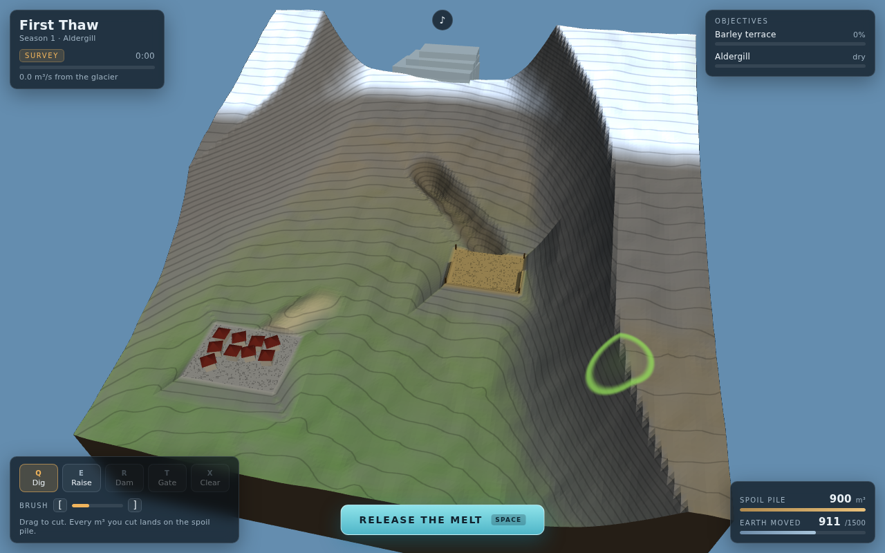
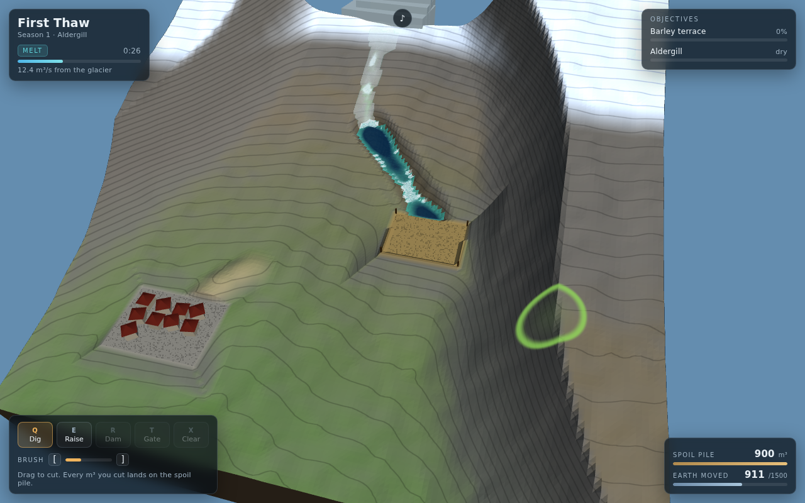
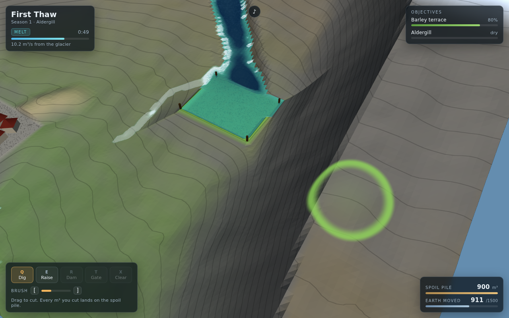
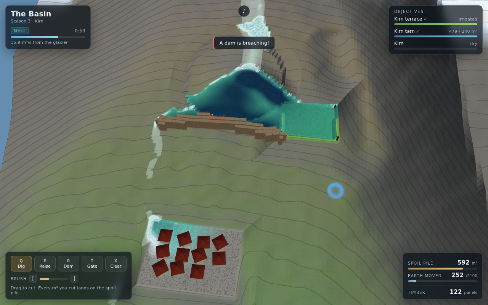

# Meltwater

A 3D valley you reshape with a shovel, and a **real fluid** that decides whether you
got it right. The glacier melts on a timer, every drop obeys a shallow-water
simulation, and you never touch the water — you only move dirt.

| Survey: plan before the water arrives | The melt: your channel, running |
|:---:|:---:|
|  |  |

| A terrace filling | A dam letting go |
|:---:|:---:|
|  |  |

## What it is

Every other 3D game in this repo hands you an avatar with a velocity vector.
Meltwater has no avatar at all: you are the landscape, and the antagonist is a
fluid that conserves volume. Water you sent the wrong way is *gone* — it does not
respawn, and there is no undo once the melt is running.

Each season has three phases:

1. **Survey** (paused) — read the contour lines, cut channels, raise levees, place
   dams and sluice gates.
2. **The melt** (real time) — the glacier pours. Terraces drink, the reservoir
   fills, the village floods if you got it wrong. You can still dig, at triple
   cost, and work the gates.
3. **Settlement** — irrigation, water banked, damage, and what it cost you in earth.

### The water

Pipe-model shallow water on a 128×128 grid (Mei et al., *Fast Hydraulic Erosion
Simulation*). Each edge carries a flux accelerated by the difference in water
**surface** height between neighbours; a per-cell scale factor stops any cell
emptying past zero, which is what makes it volume-conserving and impossible to
blow up. Over a full melt the audit — poured, minus drained, minus what is
standing in the valley — closes to under half a percent.

Everything the game asks of you falls out of that model rather than being
scripted: water finds the low line by itself, a 20 cm mistake in a ridge sends it
somewhere else, a filled basin backs up and spills from its lowest lip, and a dam
does not stop water so much as decide when it arrives.

### Cut and fill

One number governs earthworks: the **spoil pile**. Digging grows it, raising
spends it, and both count against a per-season cap on earth moved. The spoil for a
levee has to come out of a trench you chose the location of — which is what turns
a sandbox into a game.

### Dams, gates and erosion

Dams hold until the head of water behind them beats their strength, then go all at
once and take their neighbours part of the way with them. Sluice gates (keys
`1`–`4`) are dam segments you can open mid-melt for a controlled release. From
season 5 the ground is soft: fast water deepens its own channel and slow water
silts one up, bounded to about a metre either way of the ground you shaped, so the
channel you planned is not quite the channel you have at t+40 s.

## The six seasons

| # | Valley | What it teaches |
|---|---|---|
| 1 | First Thaw | Dig a diversion where the channel bed still sits above the terrace |
| 2 | Two Mouths | One glacier, two terraces — split the flow, and a village at the confluence |
| 3 | The Basin | Dam the tarn's lip, bank the water, cut a spillway out of the side |
| 4 | Terraces | Three paddies and not enough water at once: sequence them with gates |
| 5 | Soft Ground | Erosion — speed is what widens a channel, and what moves it |
| 6 | The Big Thaw | Two mouths, a village on the floor, and an ice dam that lets go at 52% |

## Running it

```bash
cd showcase/apps/meltwater
python3 -m http.server 8080
# open http://localhost:8080
```

No build step, no network access, no dependencies to install — Three.js is
vendored in `vendor/`. ES modules need an HTTP server; `file://` will not work.

Desktop first (mouse and keyboard); touch works for sculpting and two-finger
orbit, but the HUD is tight on a phone.

## Controls

| Input | Does |
|---|---|
| Left-drag on the ground | Apply the current tool |
| `Q` / `E` | Dig / Raise |
| `R` / `T` | Dam / Sluice gate |
| `X` | Clear a structure (refunds most of the timber) |
| `[` `]` | Brush radius |
| Right-drag | Orbit · wheel zooms · middle-drag pans |
| `WASD` | Pan the camera |
| `Space` | Release the melt |
| `1`–`4` | Open/shut sluice gates |
| `M` / `Esc` | Mute / pause menu |

## How it is put together

```
src/
├── grid.js     128² grid helpers, seeded value noise
├── water.js    the shallow-water solver and the erosion pass
├── world.js    valley generation: profile, ridges, basins, terraces, villages
├── levels.js   the six seasons and the melt-rate curve
├── tools.js    cut and fill, dams, gates, and dam failure
├── input.js    orbit camera, height-field ray-march picking, pointer/keys
├── render.js   terrain and water shaders, structures, props
├── hud.js      objectives, budgets, toasts, screens
├── audio.js    every sound synthesised at runtime — no audio files
└── main.js     phases, objectives, scoring, the frame loop
```

Both terrain and water are custom GLSL3 shaders that take their normals from
screen-space derivatives, so sculpting never has to recompute a normal buffer.
Terrain elevation is read straight off the mesh in the fragment shader to draw
one contour line per metre, which is what makes a valley legible enough to plan
in. Picking ray-marches the height field instead of raycasting 32k triangles.

The river's roar is one noise source whose gain and cutoff track the total moving
volume in the valley, so it genuinely gets louder as the valley runs faster.

## Notes

- Progress and best scores live in `localStorage` under `meltwater.progress.v1`.
- The sim runs on fixed 8 ms steps decoupled from the frame rate, so a slow
  machine runs the same season, just less smoothly.
- `window.MELTWATER` exposes `beginLevel`, `startMelt`, `fastForward` and
  `stroke` — the hooks the screenshot tooling uses to play a season without a
  mouse.
