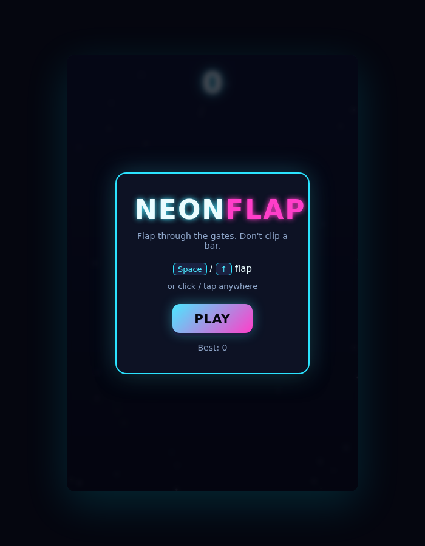
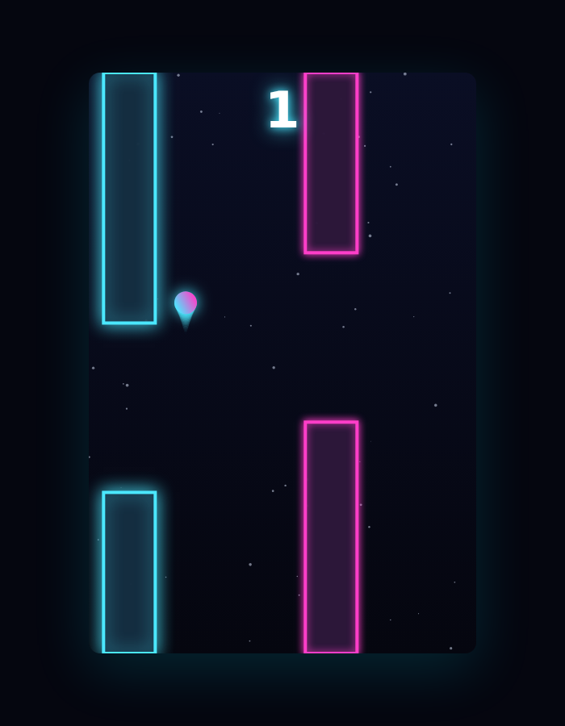

# Neon Flap

A one-button neon arcade flyer. Gravity constantly pulls your glowing comet
down — flap to fight it and thread the gap in each scrolling gate. Clip a
bar or touch the edge and it's game over. One input, instant retry, one more
go.

| Title screen | Mid-flight (score 4) |
|:---:|:---:|
|  |  |

## How to play

| Action | Keys | Touch / Mouse |
|--------|------|---------------|
| Flap | `Space` / `↑` | click / tap anywhere |
| Start / retry | `Space` / click / tap | tap |

- Gravity is constant; each flap gives the comet a capped upward kick.
- Thread the gap in a gate to score +1 — the gate flashes when you pass cleanly.
- Difficulty ramps gently with score: gates scroll faster and the gap
  narrows, capping out at a still-fair difficulty around score 25.
- Clip a bar, or touch the floor/ceiling, and it's game over.

Your best score is saved in `localStorage`.

## Run it

It's a static site — serve the folder and open it:

```bash
cd showcase/apps/neon-flap
python -m http.server 8080
# open http://localhost:8080
```

## Tech

Vanilla JS (ES modules), Canvas 2D, CSS3. No frameworks, no bundler, no
dependencies.

- `index.html` / `style.css` — layout, HUD, title/game-over overlays.
- `game.js` — game state, physics, gate spawning, scoring, collisions.
- `render.js` — Canvas 2D drawing (starfield, gates, comet trail, particles).
- `input.js` — keyboard/mouse/touch input, mapped to a single `flap` action.
- `main.js` — wires it together with a fixed-timestep `requestAnimationFrame` loop.

See [`PRD.md`](./PRD.md) for the full design spec.
