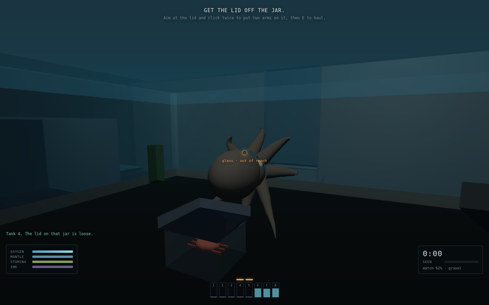
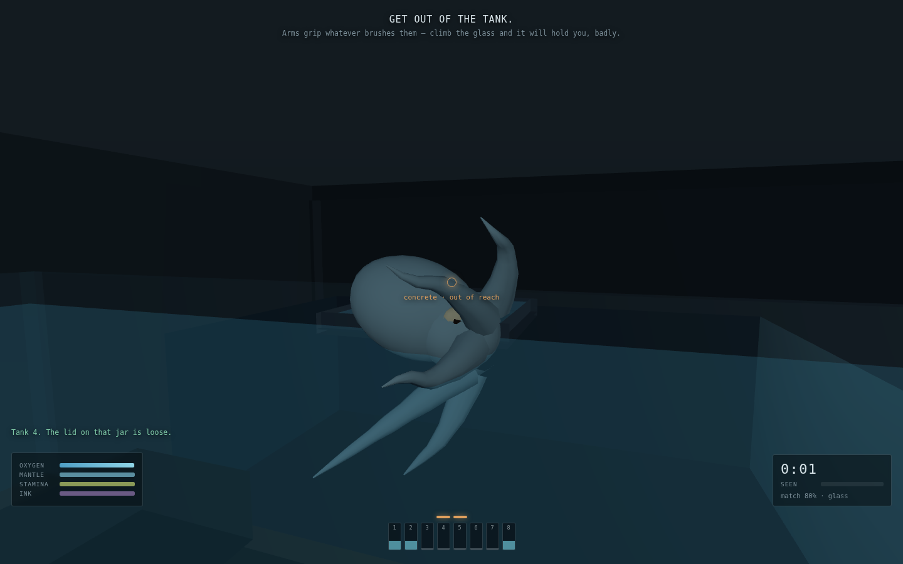
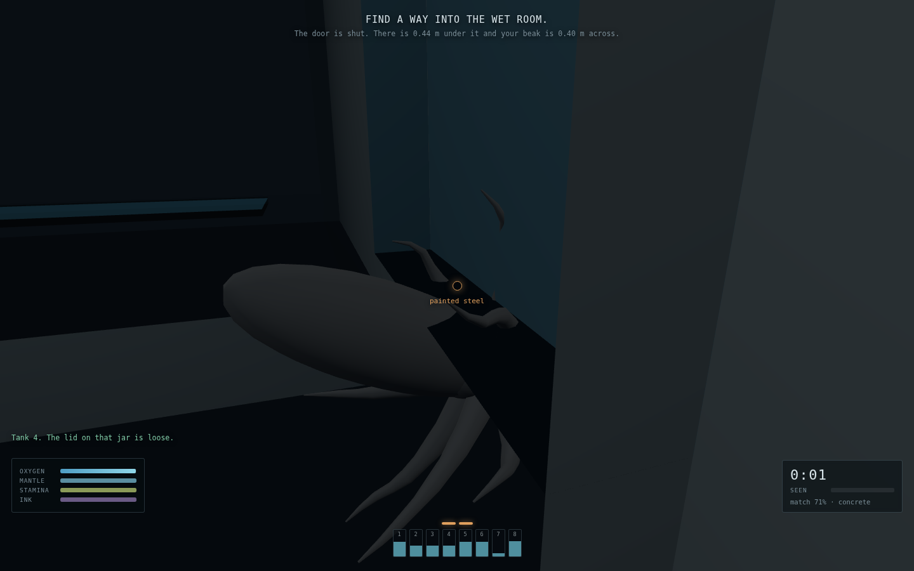
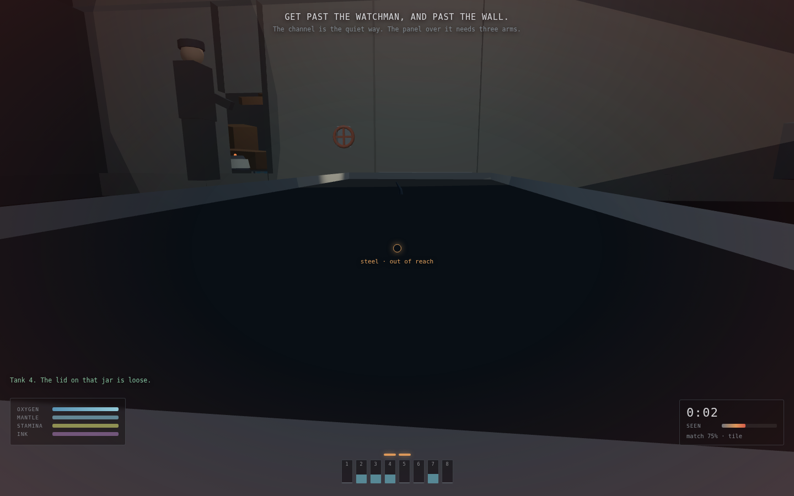
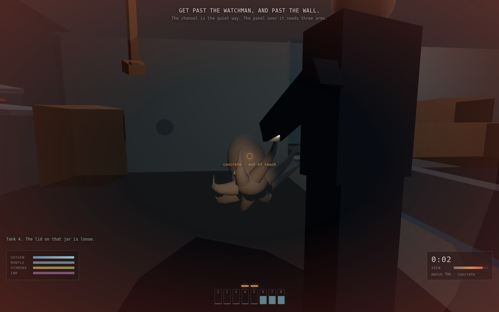
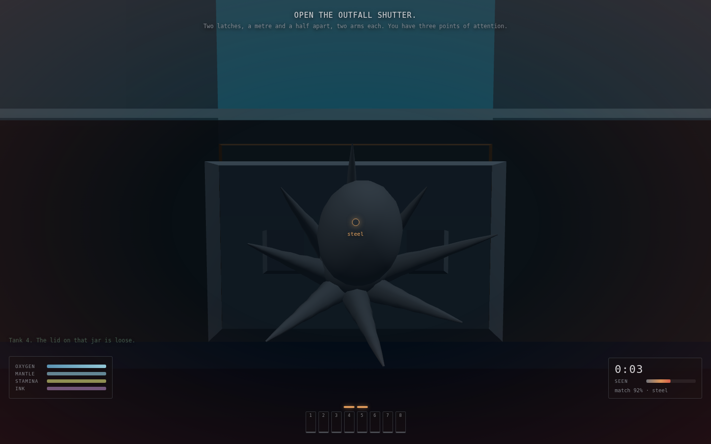

# Nine Minds

A 3D escape game in which you play an octopus whose eight arms are eight
*separate* decision-makers. You do not move them. You have a body you can steer
and **two points of attention**, and every arm you are not spending one on will
grip, probe, cling and flinch entirely on its own.

| The tank, and a jar somebody left loose | Matched 80% to the glass, on the way out |
|:---:|:---:|
|  |  |

| Poured flat under a door with 0.44 m of clearance | Under the grating, matched to wet tile |
|:---:|:---:|
|  |  |

| The watchman, and a torch that is about to swing | The outfall shutter, and the two latches |
|:---:|:---:|
|  |  |

## What it is

It is 2:40am in a marine research facility. You are *Octopus vulgaris*, tank 4.
Three hundred metres of concrete, a night watchman and a floor scrubber stand
between you and the outfall pipe that runs to the sea.

The whole game is built on one fact: around two thirds of an octopus's neurons
are not in its head. Each arm carries its own ganglion and grips, tastes,
rejects and withdraws without asking the brain. So the game gives you *intent*
and nothing else — and makes delegation the skill.

## The mechanic

**Focus is the economy.** You have two attention slots (three once you have
eaten). Commanding an arm holds a slot while it reaches. The moment it grips, it
drops to `holding` and gives the slot back — but nobody is minding it any more,
so the grip decays at a rate set by the surface. Rough rock is nearly free; wet
aquarium glass is atrocious.

That produces the verb the game is made of: **set and leave.** Anything needing
more than two arms — the grating panel needs three, the outfall shutter needs
four across two latches — has to be assembled out of arms you already released
and are now racing the decay on. `E` hauls every committed arm at once and the
force is the *sum of their grips*, so the failure is never a mistimed press, it
is "I spent too long on the third one".

**Free arms are not idle.** They grip whatever brushes them, which is how you
climb without thinking about climbing; they probe crevices; and when you are
frightened they flinch, which knocks things over, which makes noise, which is
how you get caught.

Everything else follows:

- **Soft body.** Squeeze drives your radius from 0.40 m down to 0.20 m — the
  beak, the only hard part of the animal. Collision runs against that live
  radius, so *any gap wider than your beak is a door*. There are no keys in this
  game. Squeezing halves your speed, doubles oxygen burn, freezes camouflage and
  stops you jetting.
- **Ninety seconds of air.** In water you breathe; on dry concrete you do not,
  and every short route is dry.
- **Camouflage is a rate, not a state.** The skin samples the substrate under
  you and blends toward it; standing still blends fast, moving breaks it.
  Detection is `(1 − match) × illumination × motion / distance²`, so you are
  never "hidden", you are *being seen at some rate*, and you can attack any term
  in the product.
- **Ink.** One charge: a body-shaped pseudomorph that holds the watchman's
  attention for four seconds, plus a cloud that breaks line of sight.

## Controls

| Input | Action |
|---|---|
| `W A S D` | Move. On a wall you are gripping, `W` is *up the wall* |
| Mouse | Camera · **left click** commands the best-placed free arm at the reticle |
| `E` | Haul — contract every committed arm at once |
| `Q` | Re-tighten the weakest grip (costs a slot for a moment) |
| `Tab` | Release every arm |
| Right mouse / `C` | Squeeze |
| `Space` | Jet (submerged only) |
| `Shift` | Freeze — stop dead, camouflage blends at full rate |
| `R` / `F` | Rise and sink while swimming |
| `X` | Ink · `M` mute |

## The building

One continuous map, three zones, no loading: **the gallery** (your tank, the
jar, the first dry crossing), **the wet room** (the channel, the watchman, the
light cord, the grating panel and the sluice valve) and **the pump hall** (the
scrubber, the intake, and the outfall shutter). Then the pipe, and the sea.

## Running it

```bash
cd showcase/apps/nine-minds
python3 -m http.server 8080
# http://localhost:8080
```

ES modules need an HTTP server; `file://` will not work.

## Technical notes

- Three.js r163, vendored in `vendor/`. No CDN, no build step, no asset files —
  every piece of geometry, every colour and every sound is generated at load.
- The building is a list of ~140 axis-aligned boxes merged into two draw calls
  with baked vertex colours. The same list serves collision, the substrate
  lookup for camouflage, line-of-sight for the watchman, and reticle picking —
  so camouflage is a property of the level geometry rather than a set of trigger
  volumes.
- Arms are quadratic curves through a control point that bows away from the body
  by however much slack the arm has: taut reads as a straight line, slack reads
  as a curl. Each is skinned into a pre-allocated tube (10 rings × 8 radials)
  updated in place; no geometry is allocated at runtime.
- Audio is synthesised with the Web Audio API — pump hum, room hiss, suction
  pops, the jet, and a heartbeat whose rate tracks how close you are to being
  caught. A lowpass sweeps shut whenever you are underwater.

`PRD.md` in this folder has the full design rationale.

## Key parameters

All in `js/config.js`: body radius and beak diameter, arm count/length/segments,
grip decay base, focus slots, breath rates, camouflage blend rates, the
detection constants, and the per-surface `slip` and `rough` values that decide
how long a grip lasts and how well you can hide on it.
