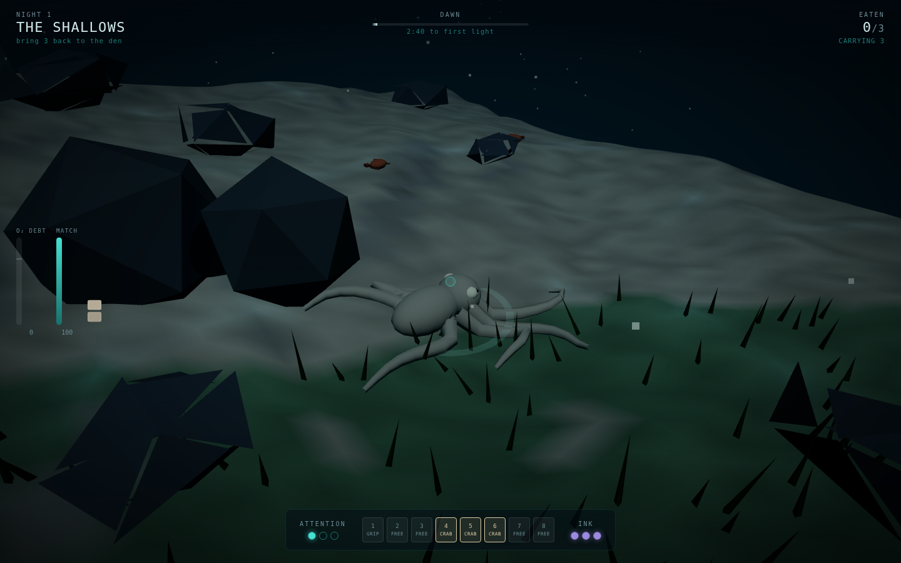
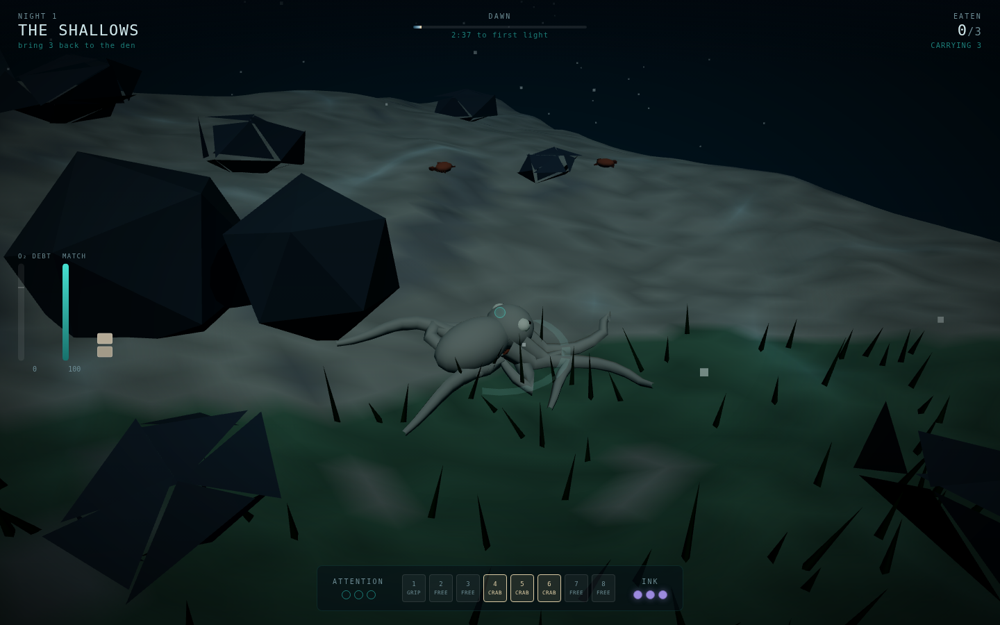
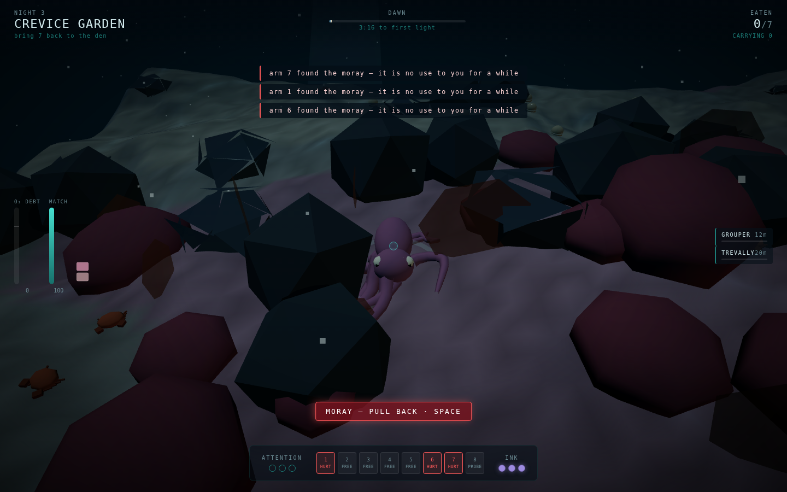
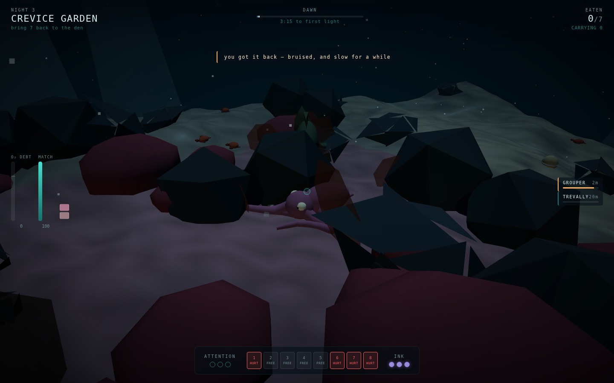
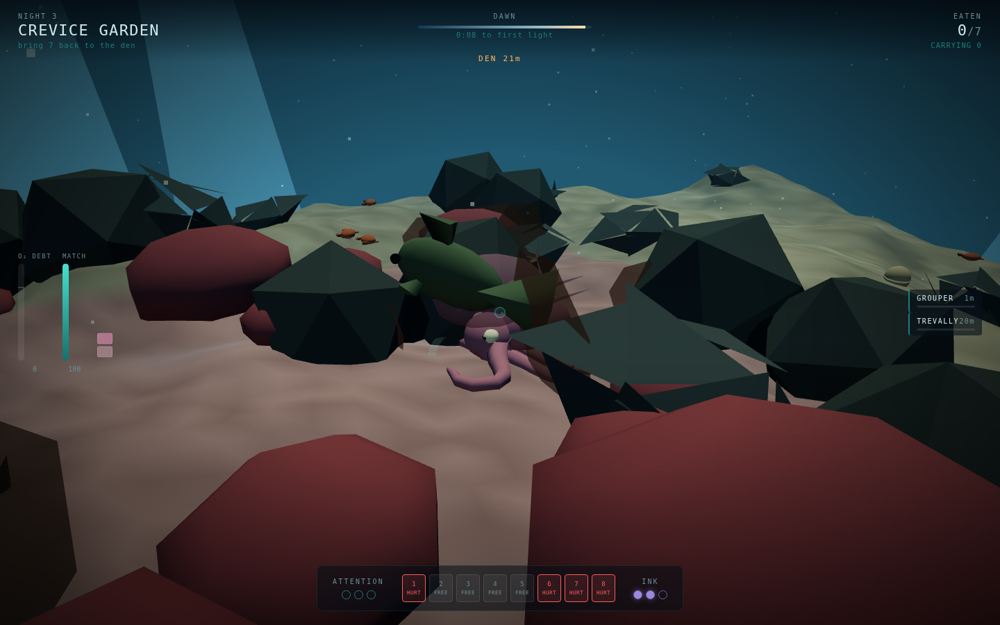
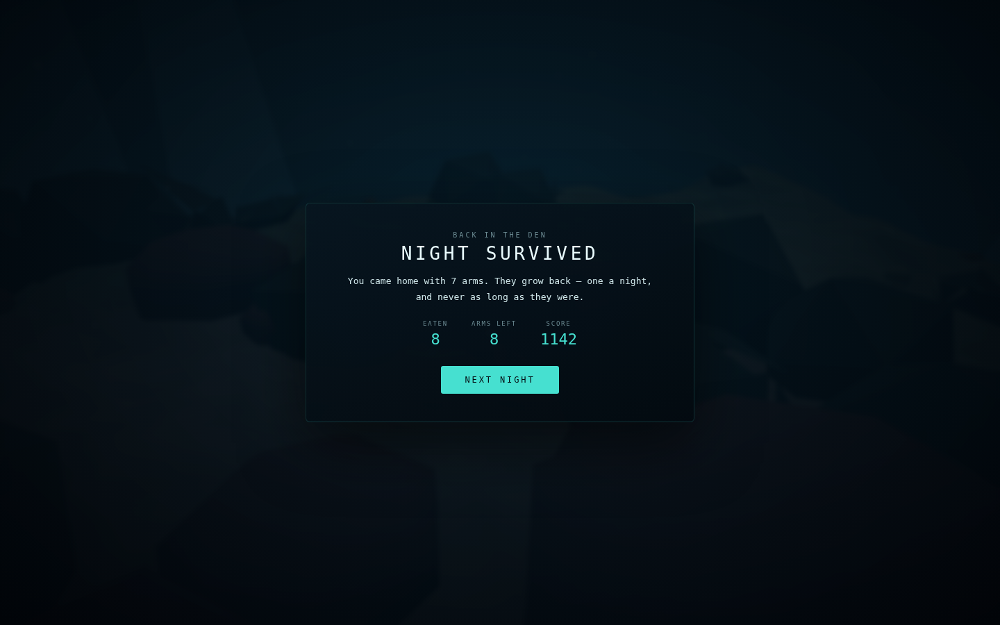

# The Other Five

A 3D reef-survival game where you are an octopus — and you do **not** get to drive
your own arms. An octopus has nine brains: one in the head, one in each arm. You
are the one in the head, you can consciously attend to **three arms at a time**,
and the other five are down there making their own decisions.

| The reef, and three arms doing their own thing | Matched to coral, holding still |
|:---:|:---:|
|  |  |

| An arm found the moray | Wrong colour, open sand, something coming |
|:---:|:---:|
|  |  |

## What it is

Five nights on a reef where everything bigger than you eats things like you. Each
night has a quota of prey to eat and a den to be back inside before first light.
You are not fast and you are not armoured. You are *soft* — so you fit places
nothing hunting you fits — and you are **invisible when you decide to be**, which
is a decision that costs attention you were spending on something else.

## The one idea

Three attention pips. A pip is spent by:

- an arm **in transit** to something you clicked (released the moment it arrives —
  an arm that is already holding on runs its own local program)
- an arm you are actively **prying** with
- **focused camouflage** (`C`)
- **squeezing** (`Shift`)

Everything else your body does, it does without you. Every unattended arm runs a
reflex ladder each tick:

```
HURT   → recoil, useless for 12 s
HOLD   → keep the food, and eventually feed it to you unprompted
SNATCH → food within 1.4 m → take it        (free meals you never saw)
PROBE  → an unprobed crevice within 1.9 m → reach in
WALK   → otherwise, join the crawl gait
```

A crevice holds shrimp, or nothing, or a moray. Reflex arms are why the game is
not a chore, and reflex arms are why the game kills you. Both.

## Controls

| Key | |
|---|---|
| `W A S D` | crawl — speed scales with how many arms are planted |
| mouse | look, and aim the reticle |
| left click | task an arm at what you are aiming at |
| right click | let go — release every arm |
| `Shift` | squeeze: fit through gaps, halve your silhouette |
| `C` | focus camouflage |
| `Space` | jet — fast, anaerobic, loud |
| `Q` | ink — leaves a decoy shaped like you |
| `F` | eat what you are holding |
| `P` | pause |

## The systems underneath

**Camouflage** is three values — hue, lightness, papillae — drifting toward the
substrate under your body:

```
rate  = 0.35 /s passive, 1.60 /s focused, × (1 − 0.8 × speed)
match = 1 − ‖skin − substrate‖
```

Five substrates (sand, rubble, coral, seagrass, rock) with different signatures,
mapped into the renderer's own colour space so a match on the meter is a match on
screen. *Where* you stop matters as much as whether you stop.

**Being seen** is an evidence accumulator, not a vision cone:

```
cue        = 0.60 × (1 − match) + 0.62 × motionWeight × speed + 0.45 × litByTorch
gain       = cue × facing × falloff(distance) × acuity
suspicion += (gain − 0.14) × dt          [0 … 1]
```

At 0.5 the animal turns and investigates; at 1.0 it commits. A grouper's acuity is
1.0; a reef shark's is 1.5 and it weights movement twice as heavily — you cannot
out-hide a shark, you have to not move. Below the decay floor nothing can build a
case against you at all, which is what makes holding still a real defence rather
than a delay.

**Getting caught** asks one question: is any arm gripping hard substrate?

- **Yes** → autotomy. That arm is severed, keeps writhing, and holds the predator
  for eight seconds while you go. You continue with seven.
- **No** → the night ends.

Arms regrow one per night, so a run is a slow accounting of every time you were
somewhere soft when something committed.

**Jetting** is anaerobic, because an octopus's systemic hearts stop while it jets.
It fills an oxygen-debt bar that only drains while you are slow, and a full one
halves everything until it clears. The heartbeat in the mix is that bar.

**Ink** is a pseudomorph — a mucus-bound decoy that inherits your *current* skin
and drifts. Inking while badly camouflaged produces a decoy that looks exactly as
wrong as you do and fools nothing, so ink is a tool for escaping *well hidden*,
which is the opposite of when players reach for it.

## Nights

| # | Reef | Introduces | Quota |
|---|---|---|---|
| 1 | The Shallows | crawl, task an arm, crabs | 3 |
| 2 | Rubble Flats | camouflage, the grouper | 5 |
| 3 | Crevice Garden | squeeze, clams (two-arm pry), morays | 7 |
| 4 | Sand Channel | reef shark, ink, open crossings | 9 |
| 5 | The Trap Line | fish pots, a diver's torch | 11 |

Dawn is not a timer readout, it is the sky: the water goes from near-black to
grey-blue and camouflage stops being enough.

| First light | Back in the den |
|:---:|:---:|
|  |  |

## Running it

```bash
cd showcase/apps/other-five
python -m http.server 8080
# open http://localhost:8080
```

ES modules need an HTTP server — `file://` will not work.

## Technical notes

- Three.js r163, vendored locally. No CDN, no build step, and **no asset files at
  all** — the reef, the animal and every sound are generated at load.
- Reef: 128×128 value-noise heightfield, per-vertex substrate colouring, instanced
  boulders / coral / sea fans / seagrass, and a den with a shell midden at the door.
- Arms: eight 10-node Verlet chains, distance-constrained with a tip-weighted
  solve so reaching wins over sag, rebuilt each frame into one 400-vertex tapered
  tube mesh (pentagonal cross-section) — one draw call for the whole animal.
- Caustics are injected into the terrain material through `onBeforeCompile`: two
  ridged sine layers sampled in world XZ, no texture.
- Audio is entirely synthesised — surge, reef hiss, a heartbeat that tracks oxygen
  debt, jet, shell crack, crab click, and the low double note of something large
  turning toward you.
- Pointer lock is an enhancement, not a requirement; the game plays without it.

## Files

```
index.html      HUD markup and the four overlays
style.css       deep-water palette, arm chips, threat readouts
src/main.js     game loop, rules, camera, tasking
src/octopus.js  the body: arms, attention, camouflage, squeeze, autotomy
src/creatures.js prey, predators, decoys, the torch
src/world.js    reef generation, substrates, crevices, traps
src/scene.js    renderer, water column, dawn
src/audio.js    every sound in the game
src/hud.js      all DOM writing
src/levels.js   the five nights
src/rng.js      seeded noise and small maths
PRD.md          the design document this was built from
```
