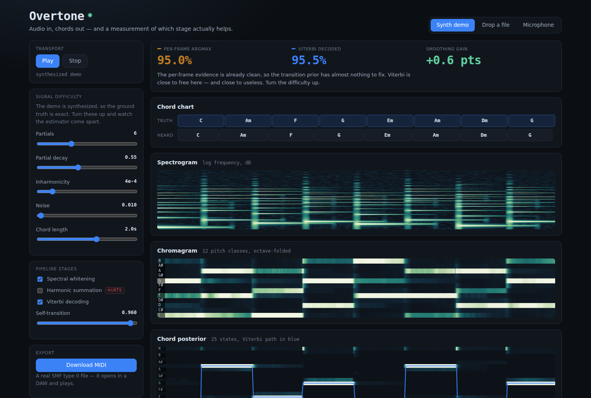
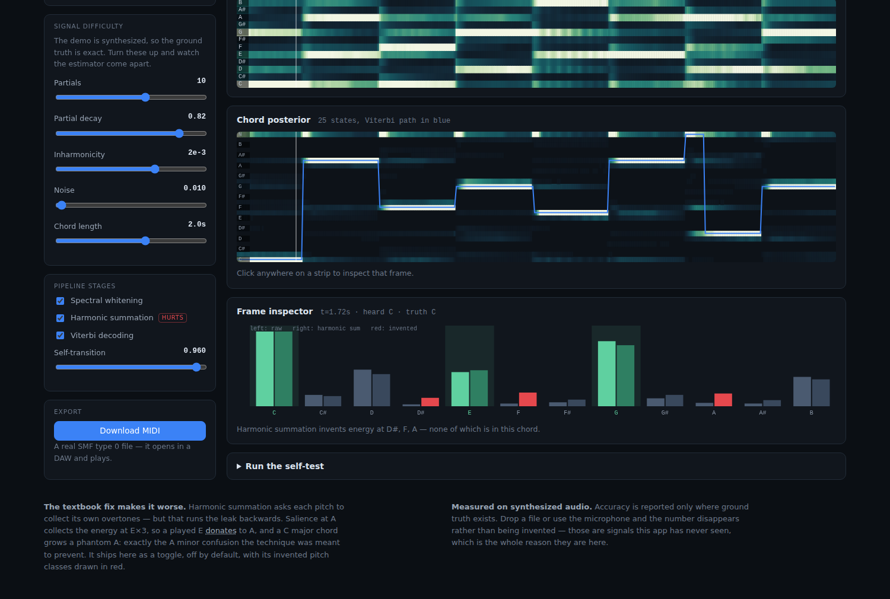
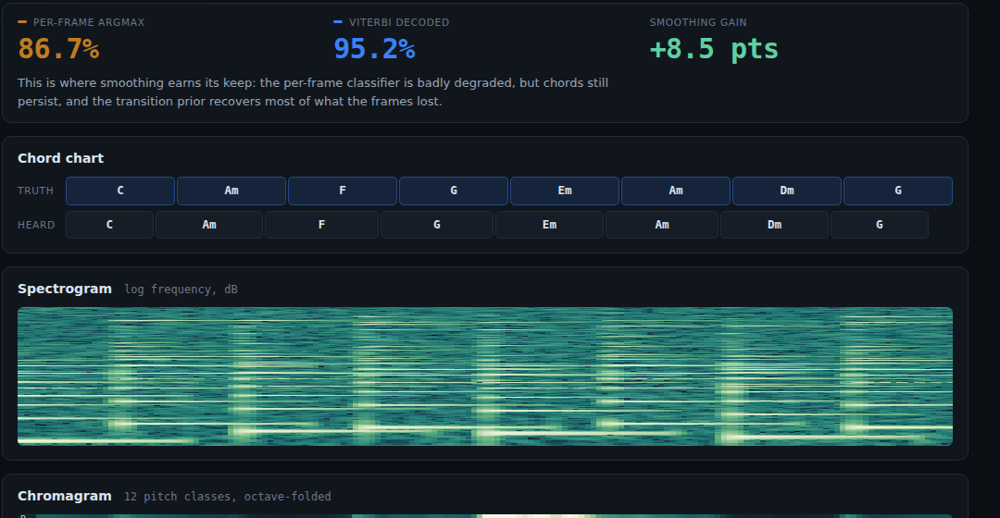
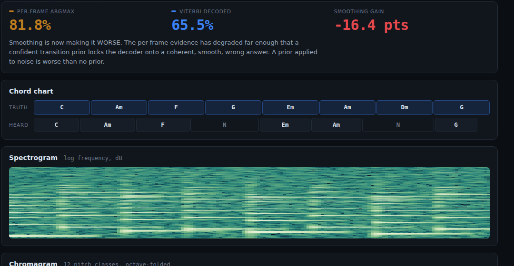

# Overtone

A chord transcriber that **listens**. Audio in — synthesized, dropped as a file,
or straight off the microphone — and a chord chart and a downloadable MIDI file
out, with every stage of the estimator drawn and every claim measured rather
than asserted.

| The pipeline, end to end | The textbook fix, inventing notes |
|:---:|:---:|
|  |  |

| Smoothing at its most useful | The same smoothing, collapsing |
|:---:|:---:|
|  |  |

See [`PRD.md`](./PRD.md) for the full product spec, including the thesis this
project started with and the measurement that killed it.

## The finding

This app was built to demonstrate that chord estimation needs **harmonic
summation** — because a C major chord's spectrum already contains a strong E and
G as overtones of the C itself, so raw chroma should confuse C with A minor.

The overtone leak is real and you can see it. The proposed fix is not. Measured
before it was written up, harmonic summation **makes accuracy worse at every
difficulty setting**, collapsing from 94% to 0% on a hard signal. One frame of
chroma shows why:

```
C major frame        raw    harmSum   delta
  C                  0.81    0.97    +0.16   <- chord tone
  D#                 0.01    0.12    +0.11   GHOST
  E                  0.55    0.58    +0.02   <- chord tone
  F                  0.01    0.17    +0.15   GHOST
  G                  1.00    1.00    +0.00   <- chord tone
  A                  0.02    0.18    +0.16   GHOST
```

Harmonic summation evaluates `S(p) = Σ w_h · mag(f_p · h)` — it asks each
candidate pitch to collect its own overtones. That runs the leak **backwards**.
Salience at A collects `mag(A×3) = E`, so a played E *donates* to A. Salience at
F collects `mag(F×3) = C`. The result is that a C major chord grows a phantom A —
precisely the A minor confusion the technique was supposed to prevent. Harmonic
subtraction was tried as the theoretically correct inverse; a grid search over
its coefficients chose **zero for both**, meaning no subtraction at all was best.

So the technique ships as a toggle, off by default, with its invented pitch
classes drawn in red. A negative result you can see in the spectrum is worth more
than a positive one you have to take on faith.

## The thing actually worth the project

With the original thesis dead, the interesting result is the shape of the
**Viterbi** column. Frame accuracy on the demo clip, against exact ground truth:

| Signal | argmax | Viterbi | gain |
|---|---|---|---|
| clean, 2 s chords | 95.0% | 95.5% | +0.6 |
| rich + noisy, 1 s chords | 87.3% | 95.2% | +7.9 |
| noise 0.40 | 86.7% | 95.2% | **+8.5** |
| noise 0.55 | 84.8% | 81.2% | **−3.6** |
| noise 0.80 | 73.3% | 31.5% | **−41.8** |

A transition prior is nearly worthless when the per-frame evidence is already
clean, becomes worth eight accuracy points when the evidence is degraded, and
then goes sharply **negative** when the evidence is hopeless — because a
confident prior applied to garbage locks the decoder onto a smooth, coherent,
*wrong* answer.

**Smoothing helps in the middle.** That is not a claim the app makes; it is a
curve you reproduce by dragging the noise slider, with the accuracy readout
recomputing live and turning red when the gain inverts.

## How to run

Static site, no build step, no dependencies:

```bash
cd showcase/apps/overtone
python -m http.server 8080
# open http://localhost:8080
```

ES modules need an HTTP server — `file://` will not work.

## What it does

- **Three sources.** A synthesized demo (default — no permission prompt, no
  microphone, fully deterministic), any dropped audio file, or 8 seconds off the
  microphone. The repo had no `getUserMedia` outside vendored Three.js and no FFT
  anywhere; it has synthesized sound in a dozen apps and had never once listened.
- **The whole pipeline, drawn.** Log-frequency spectrogram, whitened spectrum,
  12-bin chromagram, and the 25-state chord posterior with the Viterbi path over
  it — all on one time axis. Click any strip to inspect that frame's chroma as a
  bar chart, raw beside harmonically-summed.
- **Difficulty as a live control.** Partial count, partial decay, stiff-string
  inharmonicity, noise floor, chord length. The demo synthesizer is deliberately
  hard to transcribe — a bank of pure sines would make the estimator look
  brilliant and prove nothing.
- **MIDI export.** A real SMF type 0 file that opens in a DAW and plays. Every
  other export in this repo hands back pixels or samples you already saw.
- **Honest scoring.** Accuracy is shown only where ground truth exists. Drop a
  file or use the microphone and the number *disappears* rather than being
  invented.

## Declared limits

- **Major and minor triads only**, plus a no-chord state. Sevenths and inversions
  are excluded on purpose: more templates share more notes, so a larger
  vocabulary makes the confusion worse rather than the output richer.
- **Full polyphonic note transcription is refused**, with the reason. Separating
  overlapping harmonic series into individual notes is open research; chord
  identification is tractable only because it asks which of 25 shapes fits.
- **No beat tracking or key detection.** Bar lines are a fixed grid.
- Measured accuracy is against **synthesized** audio, which is the app grading
  its own homework. Real recordings are harder. The mic and file inputs exist
  precisely so you can hand it a signal it has never seen — and there it reports
  no number at all.

## Key parameters

| Where | Name | Default | What it controls |
|---|---|---|---|
| `js/chroma.js` | `FRAME_SIZE` | 8192 | 372 ms analysis window at 22.05 kHz |
| `js/chroma.js` | `HOP_SIZE` | 1024 | 46 ms between frames |
| `js/chroma.js` | `MIDI_LOW/HIGH` | 36 / 96 | chroma range, C2–C7 |
| `js/chords.js` | `selfProb` | 0.96 | HMM self-transition; the smoothing strength |
| `js/chords.js` | `temperature` | 0.09 | how confident one frame is allowed to be |
| `js/synth.js` | `DEFAULTS` | — | the demo's difficulty, all exposed as sliders |

## Correctness

Two components here have exact oracles, and both are checked in-page rather than
assumed (*Run the self-test*):

- **The FFT against an independently written naive DFT** — agreement to 8×10⁻¹²,
  plus Parseval energy conservation. Everything else rests on this.
- **The MIDI writer against a reader that parses its own bytes back** — variable
  length quantities checked against the canonical table from the SMF spec, note
  on/off balance, no retriggered notes, correct chunk lengths.

The chord estimator has **no** exact oracle — that is the honest part — so what
is asserted there are the invariants that must hold whatever the accuracy:
posteriors sum to 1, transition rows are distributions, the Viterbi path is in
range and never *more* fragmented than raw argmax, and segments are contiguous.
18/18 pass.

## Files

```
overtone/
├── index.html
├── style.css
├── main.js           UI wiring, sources, live recomputation
└── js/
    ├── fft.js        radix-2 Cooley-Tukey + the naive DFT it is checked against
    ├── synth.js      additive synthesizer built to be hard to transcribe
    ├── chroma.js     whitening, pitch salience, chroma folding
    ├── chords.js     25 templates, softmax posterior, Viterbi, segmentation
    ├── midi.js       SMF type 0 writer + the reader that verifies it
    ├── audio.js      file decode, microphone capture, playback, download
    ├── render.js     spectrogram, chromagram, posterior, chroma bars
    └── selftest.js   the in-page suite
```

No dependencies, no build, no network calls, no asset files — the demo audio is
generated at load.
