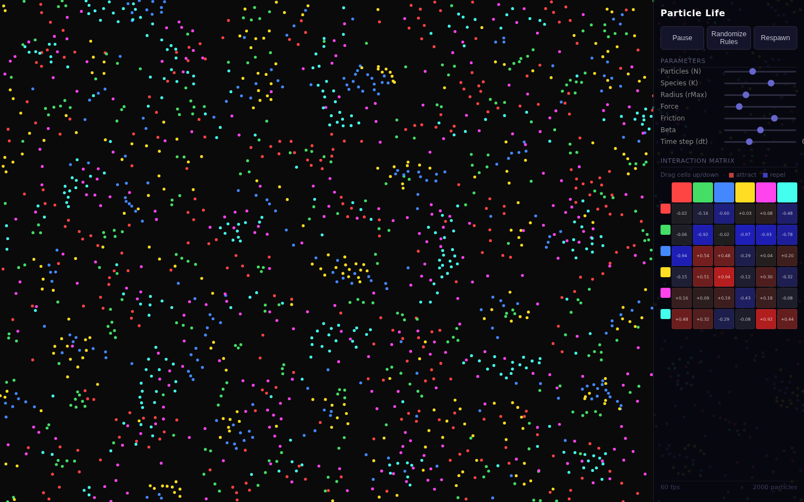
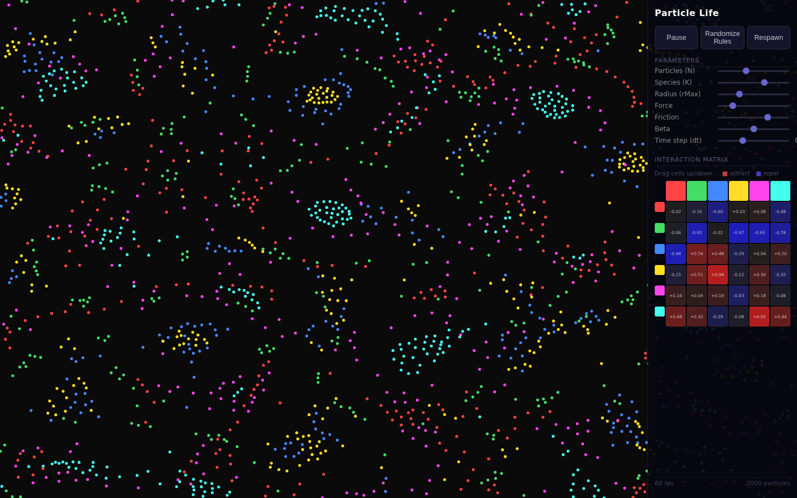

# Particle Life

A browser-based emergent particle simulation. A handful of "species" of colored particles obey pairwise attraction/repulsion rules, and from those rules alone complex lifelike behavior emerges — membranes, chasers, orbiting clusters, blobs that look like they're hunting or reproducing. None of that behavior is hand-authored; it all falls out of one little interaction matrix.

| 2 seconds in | 6 seconds in |
|:---:|:---:|
|  |  |

## Running locally

```bash
cd showcase/apps/particle-life
python -m http.server 8080
# open http://localhost:8080
```

ES modules require an HTTP server. `file://` URLs will not work.

## The model

**Particles and species.** `N` particles, each belonging to one of `K` species (identified by color), with a 2D position and velocity in normalized [0, 1]² coordinates.

**Interaction matrix.** A `K×K` matrix `A` where `A[i][j]` is the force a particle of species `i` feels *toward* a particle of species `j`. Values in [-1, 1]: positive = attract, negative = repel. The matrix is **asymmetric** — this asymmetry is what produces chasing and orbiting rather than dead equilibrium.

**Force function.** For two particles at normalized distance `r = dist / rMax`:

| Range | Behaviour |
|-------|-----------|
| `r < beta` | Always repel: ramp from -1 at r=0 to 0 at r=beta |
| `beta ≤ r ≤ 1` | Triangle: peaks at `a` (the matrix value) near the midpoint, zero at both ends |
| `r > 1` | No interaction |

**Integration (each frame):**
```
velocity = velocity × friction + acceleration × dt
position += velocity × dt
```
Boundaries are toroidal — particles wrap edge to edge, and distance calculations account for the wrap.

**Spatial grid.** Space is partitioned into cells of size `rMax`. Each particle only checks its own cell plus the 8 neighbours, keeping the loop near O(N) and letting 2000+ particles hold 60fps.

## Controls

| Control | Effect |
|---------|--------|
| **Randomize Rules** | Re-rolls the entire interaction matrix — headline feature |
| **Respawn** | Scatters particles randomly without changing the rules |
| **Pause / Play** | Freezes/resumes the simulation |
| **Particles (N)** | Total particle count (100–5000) |
| **Species (K)** | Number of species / matrix size (2–8) |
| **Radius (rMax)** | Interaction radius in normalized units (0.02–0.3) |
| **Force** | Global force multiplier |
| **Friction** | Velocity damping per step — lower = more sluggish, higher = more drift |
| **Beta** | Repulsion cutoff radius as fraction of rMax |
| **Time step (dt)** | Integration step size — smaller = more stable, larger = faster |

### Matrix editor

The `K×K` grid in the panel shows the current interaction matrix. **Drag up/down** on any cell to increase/decrease that pairwise force. Red = attraction, blue = repulsion, dark = neutral. Row = species feeling the force, column = species exerting it.

## File layout

| File | Purpose |
|------|---------|
| `index.html` | Canvas + control panel shell |
| `style.css` | Dark-theme UI styles |
| `simulation.js` | Particles, matrix, force model, spatial grid, `step()` |
| `renderer.js` | Canvas draw call each frame |
| `controls.js` | DOM panel: sliders, buttons, matrix editor |
| `main.js` | `requestAnimationFrame` loop, resize, FPS counter |

## Performance notes

- Default: N=2000, K=6, rMax=0.1 → ~63 average neighbours per particle.
- Spatial grid reduces inner loop from O(N²) to O(N × avgNeighbours).
- All particle data is stored in `Float32Array` / `Int32Array` typed arrays.
- Work buffers (grid counts, sorted particle list, acceleration accumulators) are pre-allocated and reused each frame to avoid GC pressure.
- Renderer batches particles by species to minimize `fillStyle` switches.

## Tips

- Hit **Randomize Rules** a few times until something interesting appears — most random matrices produce distinct emergent behaviour.
- Lower `Friction` (e.g. 0.6) creates more chaotic systems; higher (e.g. 0.95) creates slow, deliberate motion.
- Increase `rMax` to 0.2+ for longer-range interactions that form larger structures.
- The matrix editor lets you sculpt rules by hand — try setting all diagonal cells (same species) to +1 and off-diagonal to -1 for species that cluster but avoid each other.
