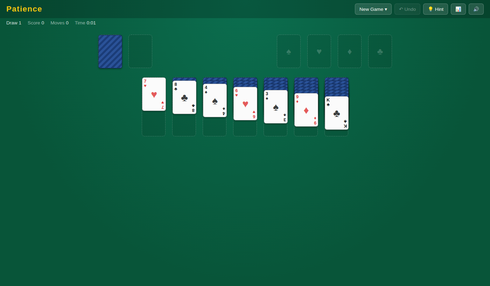
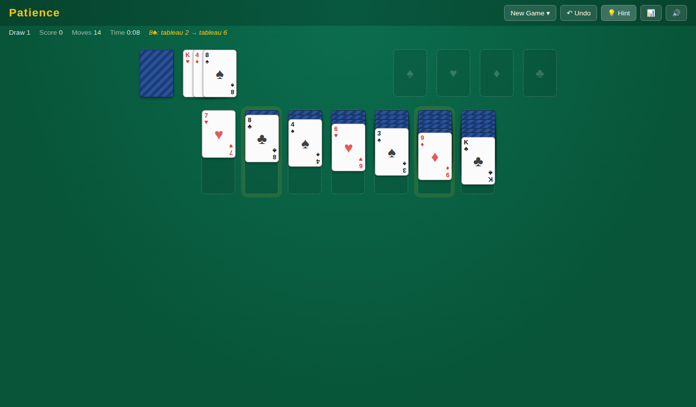
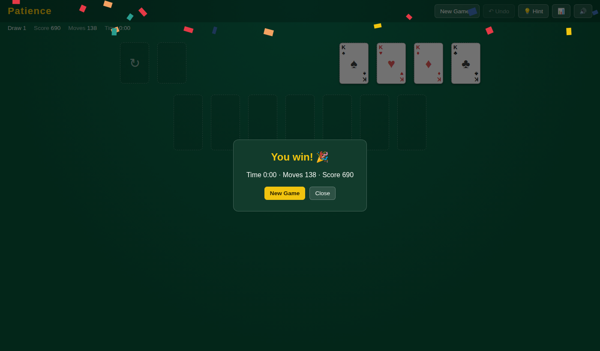

# Patience — Klondike Solitaire

A full Klondike solitaire implementation — drag single cards or whole runs,
undo freely, ask for a hint when nothing obvious is open, and let Auto
Finish play out the endgame once every card is face up. A seeded Daily
Challenge gives everyone the same deal each day and tracks your streak. No
sign-up: every stat lives in `localStorage`.

| Early deal | Mid-game with a hint highlighted | Win |
|:---:|:---:|:---:|
|  |  |  |

## Features

- **Standard Klondike rules** — 7 tableau columns, Draw 1 or Draw 3 stock,
  4 foundations, unlimited stock recycling with a small score penalty
- **Real drag and drop** — pointer-based (mouse + touch), drags a whole
  face-up run at once, snaps back with a shake on an illegal drop, and
  highlights the hovered pile green/red while dragging
- **Double-click / double-tap** a card to auto-send it to a foundation
- **Unlimited undo** via a full move-history stack
- **Auto Finish** — appears once every tableau card is face up and the
  stock is empty; plays the rest of the game out for you
- **Hint** — scans every legal move and suggests the single most useful
  one (prioritizing moves that reveal a hidden card), rather than solving
  the whole game
- **Daily Challenge** — one seeded deal per calendar date, same for every
  player; tracks a current/best streak
- **Stats panel** — games played, win rate, best time, best score, streak
- **Score, move counter, and live timer**; all sound effects (deal, flip,
  place, invalid, win fanfare) are synthesized via the Web Audio API — no
  audio files

## How to run

```bash
cd showcase/apps/patience
python3 -m http.server 8080
# open http://localhost:8080
```

## Key parameters

| Setting | Value |
|---------|-------|
| Draw modes | Draw 1 or Draw 3 (Daily Challenge is always Draw 1) |
| Scoring | +10 to foundation, +5 reveal / waste→tableau, −15 foundation→tableau, −20 per stock recycle (floored at 0) |
| Undo | Unlimited, single steps |
| Hint | One-move-lookahead heuristic — a nudge, not a solver |

## Stack

Vanilla JS (ES Modules) · CSS3 · Pointer Events · Web Audio API ·
`localStorage` — no build step, no dependencies.
