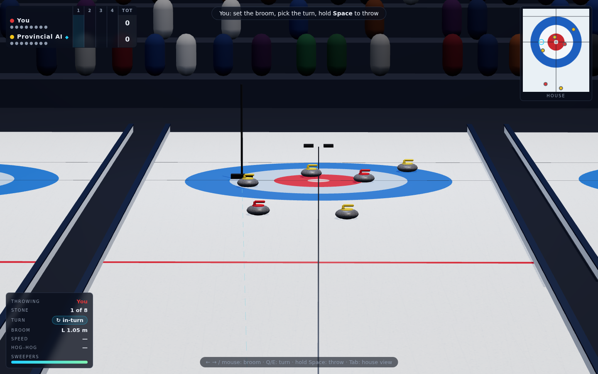
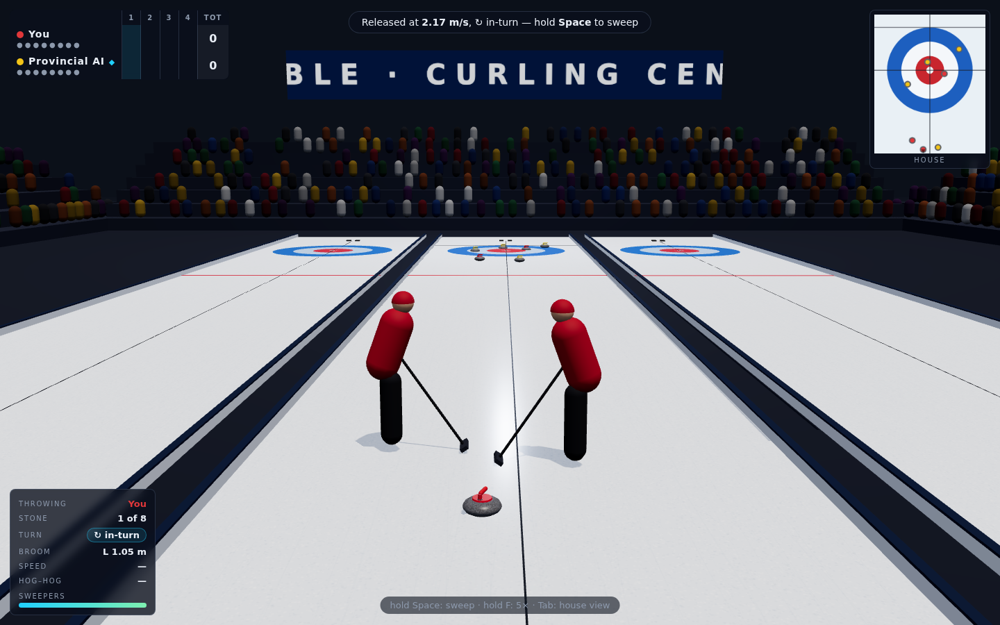
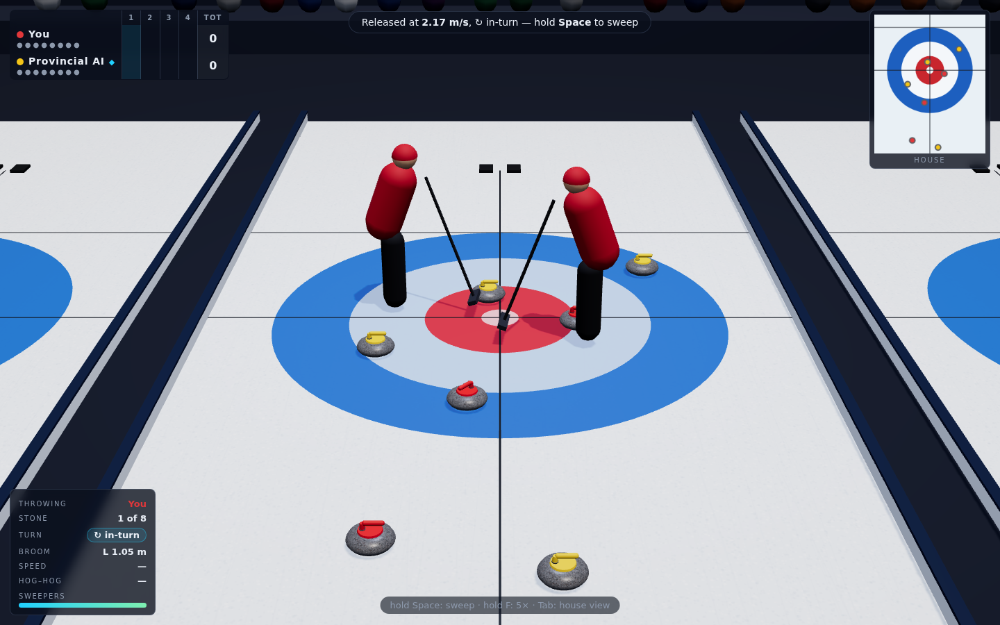
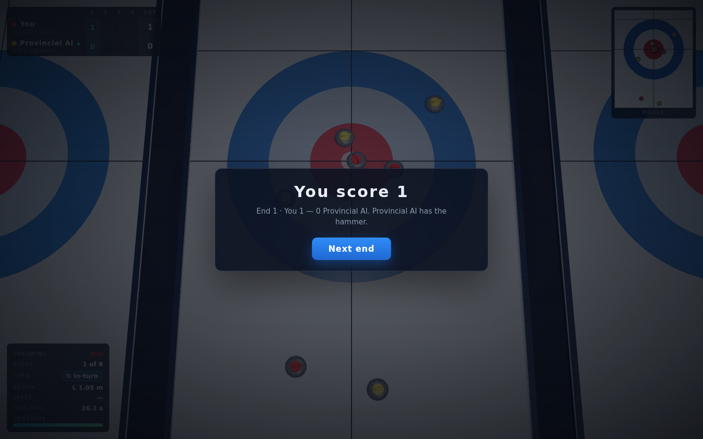
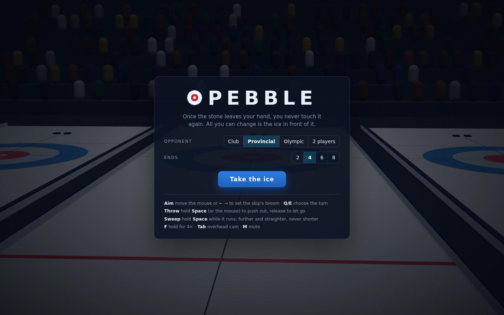
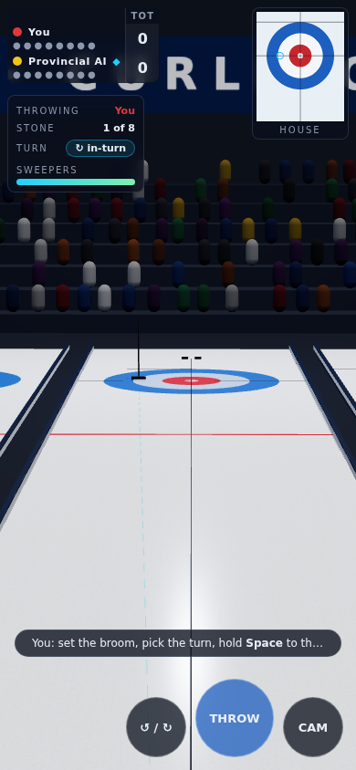

# Pebble

A 3D curling match against an AI skip. **Once the stone leaves your hand you
never touch it again.** You set the broom, pick the turn, push out and let go.
After that the only thing you can change is the ice in front of the stone.

| Reading the house from the hack | Sweep! |
|:---:|:---:|
|  |  |

| Coming into the house | Counting the end |
|:---:|:---:|
|  |  |

| Title | Phone |
|:---:|:---:|
|  |  |

## How to run

```bash
cd showcase/apps/pebble
python -m http.server 8080
# open http://localhost:8080
```

Nothing to install. three.js is vendored in `vendor/`, and every texture and
sound is generated at load time.

## How to play

| Phase | Controls |
|---|---|
| Aim | Mouse or ← → to place the skip's broom (hold Shift for fine) · **Q / E** for out-turn ↺ / in-turn ↻ |
| Throw | Hold **Space** (or the left mouse button) to push out of the hack, and release at the weight you want |
| Sweep | Hold **Space** / mouse while your stone is running |
| Watch | Hold **F** for 5× · **Enter** skips to rest on the AI's throws · **Tab** toggles the house view · **M** mutes |

On touch screens, drag on the ice to aim and use the round THROW/SWEEP, turn and
CAM buttons.

The weight meter isn't linear. Its first 60% covers the draw range slowly, and the
marks show where a stone stops if you don't sweep: hog line, guard, top of the
house, button and back line. The top 40% covers taps, takeouts and peels
quickly.

**Sweeping can't fix a heavy stone.** It lowers friction by 12% and halves curl
while you're doing it, so it carries a stone further and straighter, but it can
never make a stone stop sooner or curl more. So throw a touch light, with the
broom a touch wide. The sweepers tire after about 12 s of hard sweeping, and a
worn-out sweep does a third of the work.

Opponents: **Club**, **Provincial**, **Olympic**, or **2 players** hot-seat. Matches
are 2, 4, 6 or 8 ends, with an extra end on a tie.

## The physics

The sheet is the World Curling standard: tee to tee 34.747 m, hog lines 6.401 m
from the tees, a 1.829 m 12-foot, and a 4.75 m sheet width. Each moving stone
integrates at 240 Hz:

```
dec = μg · (1 − 0.12·sweep)                                   along −v̂
lat = Kc · clamp(ω/ω_ref) · (1 − 0.5·sweep) / (v + v_c)       across v̂, toward the turn
```

The lateral term rotates the velocity without changing its magnitude, so curl
never adds or removes energy. `node scripts/bench.mjs` checks these values:

| Check | Result | Reference |
|---|---|---|
| Draw weight to the button | 2.210 m/s, hog-to-hog **13.65 s** | Club curlers time draws at 13–15 s |
| Draw curl, broom on the centre line | **1.24 m** | 1–1.5 m on typical ice |
| Takeout curl at 3.2 m/s | **0.18 m** | hits "barely bend" |
| Full-length sweep on a light draw | **+3.63 m**, curl 1.16 → 0.75 m | sweeping is worth roughly two rings |
| Head-on hit, e = 0.85 | struck stone gets **0.925** of the speed | (1 + e)/2 |
| Scoring, blank end, biter | correct | counting rules |
| Hog line, free guard zone | stone removed; peeled guard restored | WCF rules R7, R10 |
| Olympic AI draw into an empty house | 100% of 20 | ≥ 80% |
| Olympic AI vs. a stone on the button | 100% of 20 removed or outcounted | ≥ 70% |

## The AI skip

The AI doesn't follow a script. On every throw it does four things:

1. **Proposes** about fifty shots: draws to ten spots (button, top and back
   four-foot, both sides, centre and corner guards) with each turn; takeout, hit-and-roll,
   peel and tap-back on every opponent stone; a freeze on the opponent's shot
   stone; raises on its own guards.
2. **Solves** release speed and broom placement for each shot by iterating the
   same physics on an empty sheet.
3. **Plays out** each shot on the real board, with hog-line and FGZ rulings, under
   2–3 samples of its own execution error. It scores the result from its own
   side: exact points on the last stone of the end, and before that shot
   count, closeness to the button, and guards weighted by who holds the hammer.
4. **Throws** with noise (σ 0.06 / 0.035 / 0.018 m/s and 12 / 7 / 3.5 cm for Club,
   Provincial and Olympic). It throws its draws deliberately light, then
   **sweeps them home**: every quarter second it re-predicts where the stone
   will stop if nobody sweeps, and sweeps whenever that's short of the plan.

## Files

```
index.html  style.css
src/constants.js   sheet geometry
src/physics.js     stone integrator, collisions, out-of-play
src/rules.js       scoring, hog line, free guard zone
src/ai.js          shot proposal, solver, evaluation, sweep controller
src/scene.js       three.js arena, sheet, stones, sweepers
src/hud.js         scoreboard, house inset, weight meter
src/audio.js       synthesised rumble, clack, broom, crowd
src/main.js        game flow, input, cameras
scripts/bench.mjs    physics / rules / AI checks (node)
scripts/play.mjs     plays a whole match headless in Chromium
scripts/screens.mjs  regenerates the screenshots
```

See [PRD.md](PRD.md) for the design.
