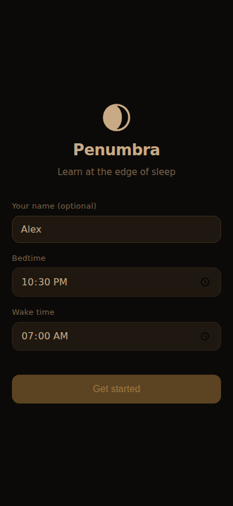
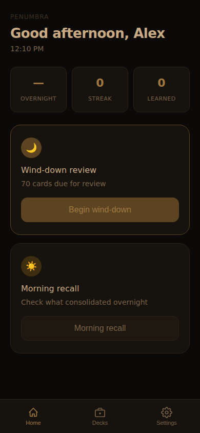
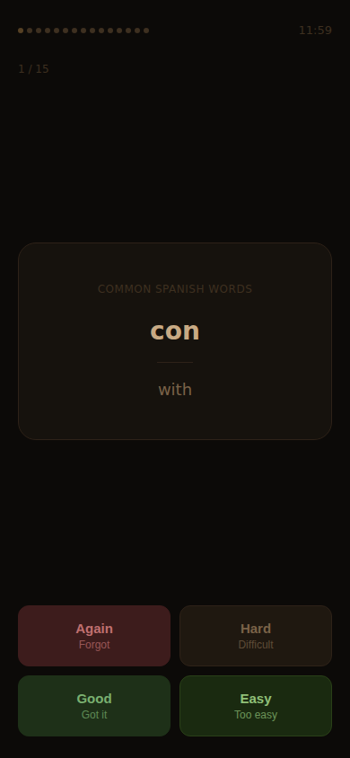
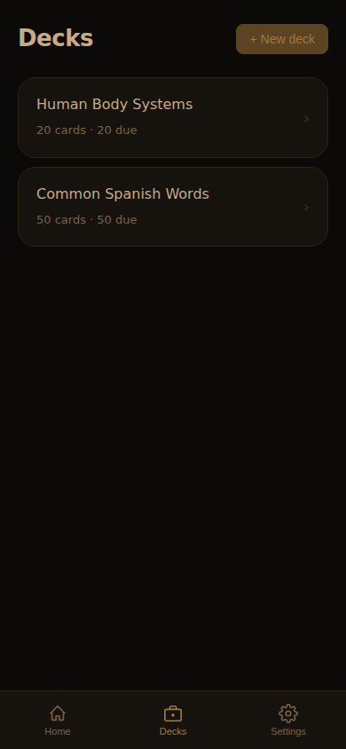
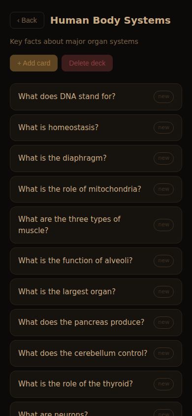
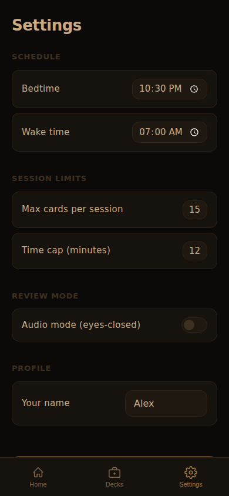

# Penumbra — Learning at the Edge of Sleep

A calm microlearning app that brackets sleep with short, low-stimulation review sessions — using sleep's natural memory consolidation to help what you study stick, without keeping you up.

**Two sessions a day, both designed to be finished:**
- **Wind-down review** (pre-sleep): a capped queue of flashcards in a dim, warm UI — ends with "that's enough, goodnight"
- **Morning recall** (wake-up): a quick two-tap check of last night's cards, measuring what consolidated overnight

| Onboarding | Home | Wind-down session |
|:---:|:---:|:---:|
|  |  |  |

| Decks | Deck detail | Settings |
|:---:|:---:|:---:|
|  |  |  |

## How to run

```bash
cd showcase/apps/penumbra
python3 -m http.server 8080
# open http://localhost:8080
```

ES modules require an HTTP server — `file://` won't work.

## What the science supports (and what it doesn't)

**Built on solid evidence:**
- Sleep-dependent memory consolidation is real — the brain replays and stabilizes recently learned material during slow-wave and REM sleep
- Studying right before sleep improves retention because no subsequent waking activity interferes
- Spaced retrieval practice (FSRS) is one of the most robust findings in learning science

**What this app does NOT claim:**
- You cannot learn new declarative material while asleep (hypnopaedia is debunked)
- We don't imply it; we don't build for it

## Features

- **FSRS-5 scheduler** with a sleep-bracket bias: prioritizes items most overdue for consolidation in the pre-sleep slot, flags them for morning re-test
- **Two starter decks**: 50 common Spanish words + 20 human body system facts — something to review on night one
- **Hard session cap** (configurable): time limit + card count limit; the app stops and says goodnight, never offers "one more"
- **Overnight retention metric**: measures what % of wind-down cards you correctly recalled the next morning — the app's north-star stat
- **Audio mode**: TTS reads card prompts aloud via Web Speech API so you can review with eyes closed
- **Dim, warm UI**: near-monochrome dark theme with red-shifted amber tones; no bright flashes
- **Morning recall UX**: two-tap recognition (Yes / Not quite) — designed for grogginess
- **Deck management**: create decks, add/edit/delete cards, view per-card FSRS state
- **Forgiving streak tracking**: counts consecutive days with at least one completed wind-down session
- **Local-first, offline-capable**: all data in IndexedDB; no server required

## Stack

- Vanilla JS (ES modules) + IndexedDB
- No build step, no dependencies
- Served by `python -m http.server`

## Key parameters

| Setting | Default | Range |
|---------|---------|-------|
| Bedtime | 22:30 | Any time |
| Wake time | 07:00 | Any time |
| Session card cap | 15 cards | 5–30 |
| Session time cap | 12 min | 5–20 min |
| Wind-down window | 60 min before bedtime | — |
| Wake-up window | 90 min after wake time | — |

## Project structure

```
penumbra/
├── index.html          SPA shell — all views, nav
├── styles/main.css     Dark/warm UI styles
├── src/
│   ├── fsrs.js         FSRS-5 algorithm (pure)
│   ├── storage.js      IndexedDB wrapper
│   ├── decks.js        Deck/card management + starter data
│   ├── scheduler.js    Sleep-bracket queue builder
│   ├── stats.js        Overnight retention & streak
│   └── app.js          App controller, routing, UI
└── screenshots/
```
