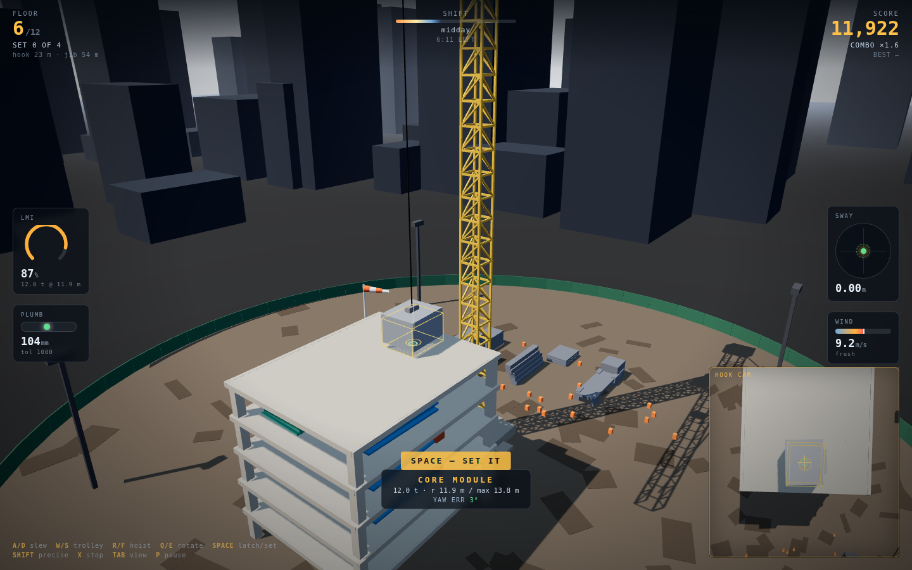
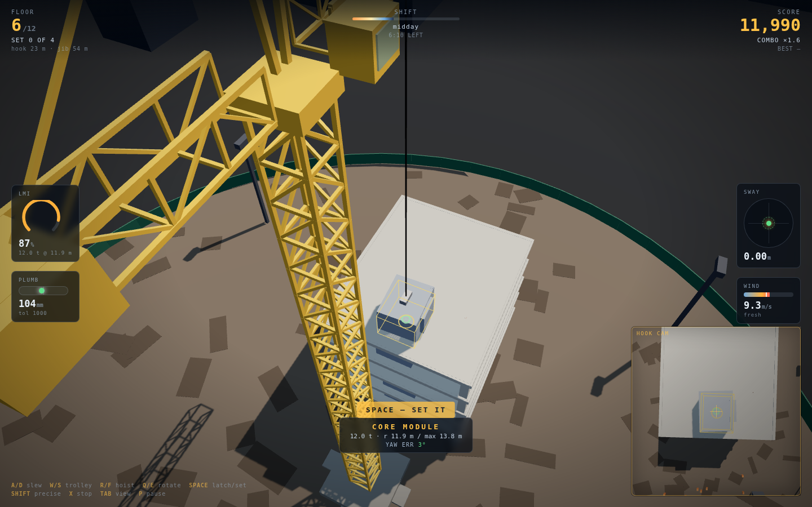
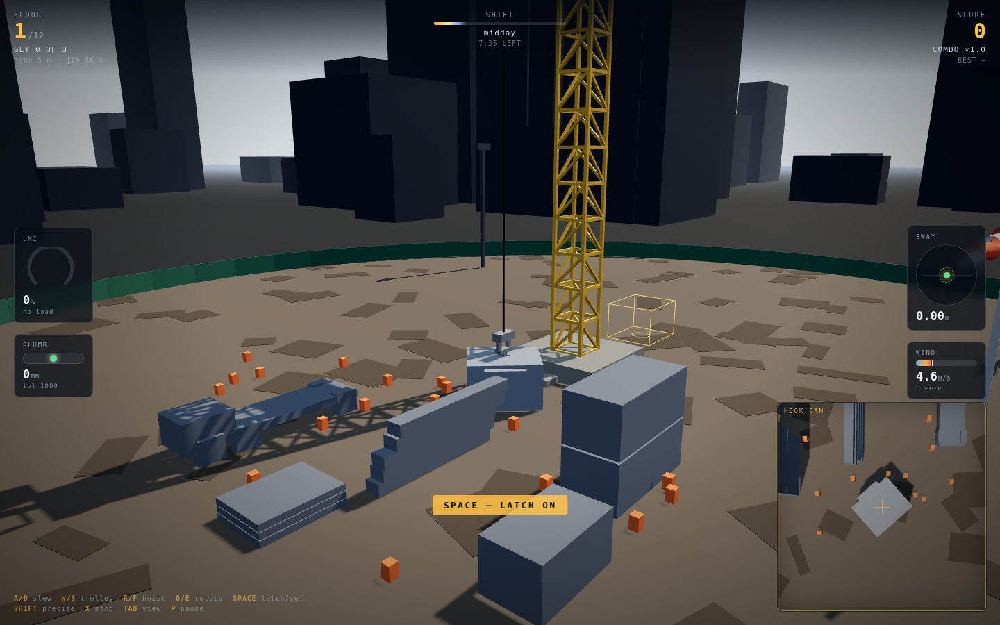
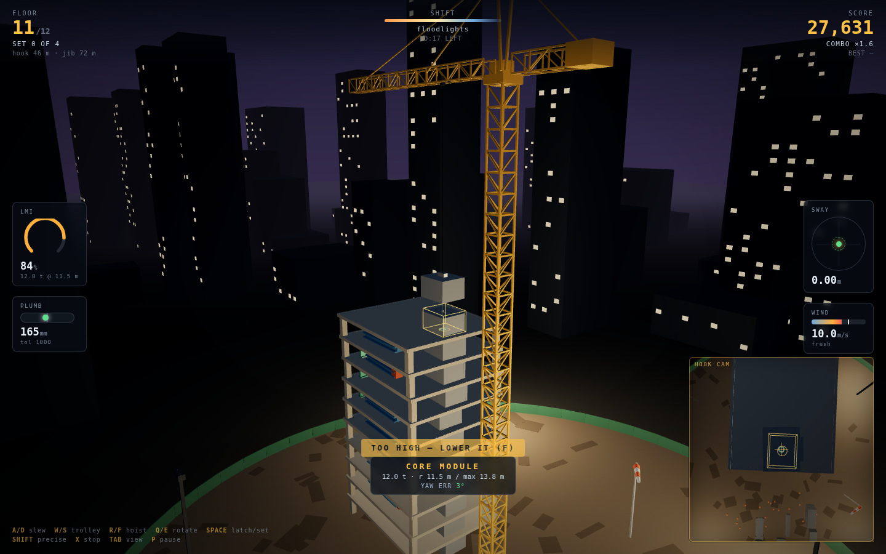
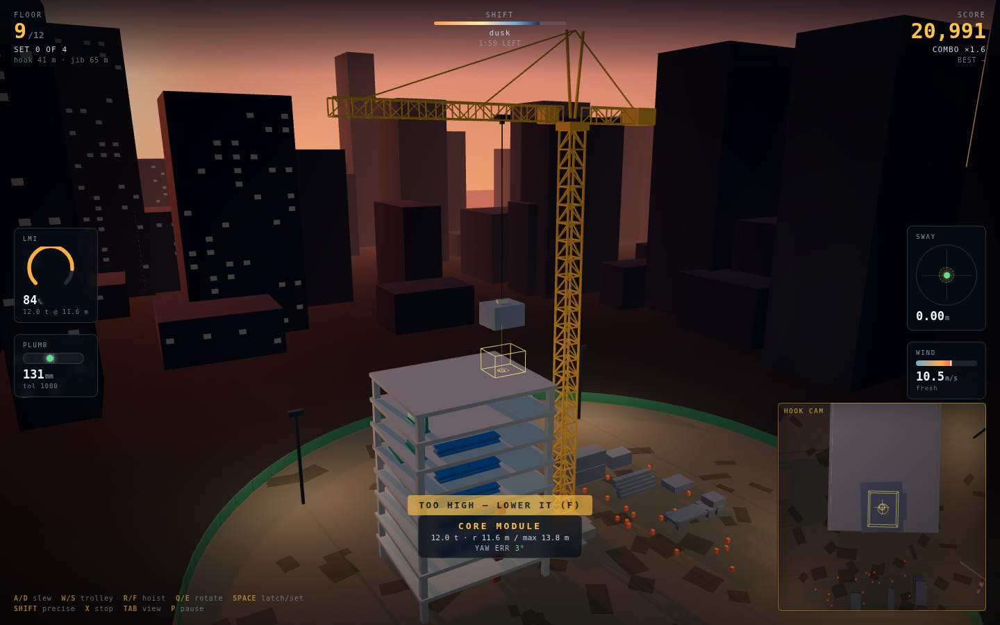
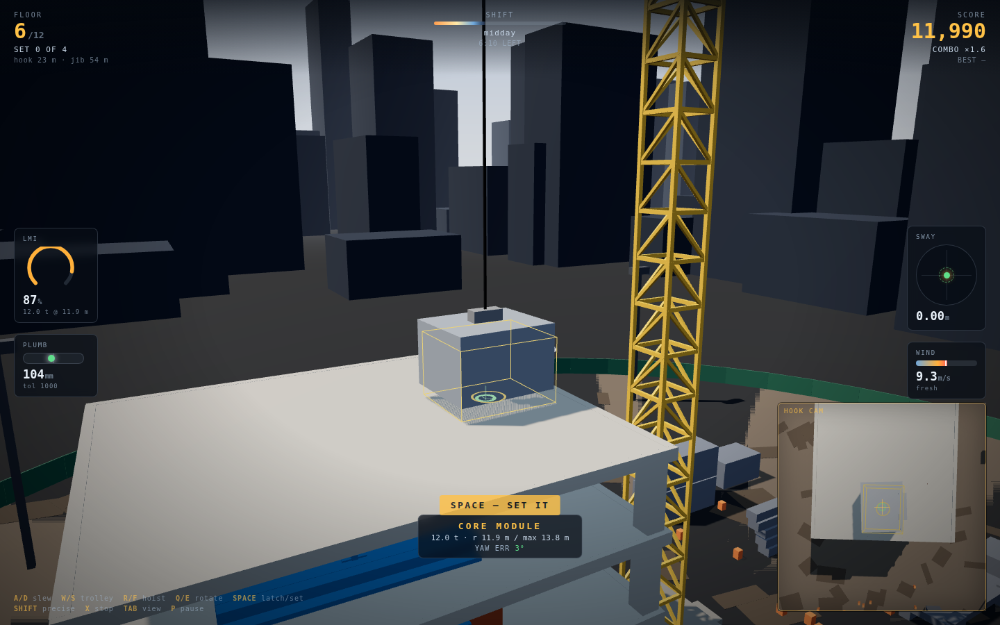

# Plumbline

A 3D tower-crane game about **the thing you cannot touch**. You drive a trolley
along a jib. The eight-tonne column is forty metres below it on a cable, and it
goes wherever its own momentum says it is going. Input reaches the load late,
filtered through a pendulum, and the only way to put anything anywhere is to stop
pressing *before* you get there.

| Setting the core module — hook cam, ghost slot, LMI at 85% | Down the jib from the tower head |
|:---:|:---:|
|  |  |

| Hooking up in the lay-down yard | Eleven floors up, on floodlights |
|:---:|:---:|
|  |  |

| Golden hour, the tower you actually built | Close in on the set |
|:---:|:---:|
|  |  |

## The one idea

The load is a mass on a rigid cable whose pivot is the trolley — a real
constrained pendulum with a moving anchor, solved five substeps a frame:

```
V += (gravity + wind)·dt
P += V·dt
P  = T + L·normalize(P − T)          T = the trolley, which you are driving
V  = V_pivot + tangential(V − V_pivot)
```

Everything the game is about falls out of those four lines:

- **Acceleration creates swing.** Start the trolley and the load stays put, so the
  cable tilts back; then it chases you and overshoots.
- **Deceleration can cancel it — but only on the beat.** Brake exactly one full
  swing after you started and the swing dies: measured on a 25 m cable, 0.22 m of
  residual sway against 9.65 m for braking half a period early. That moment is
  when the load has swung *ahead* of the trolley and is coming back at you, and
  the window is about ±0.5 s wide. This is real anti-sway crane technique and the
  sway dial shows you the phase.
- **The cable length is a difficulty dial you hold.** Period is 2π√(L/g). A long
  cable is slow and forgiving, a short one is twitchy — and hoisting up during a
  swing *pumps* it, for the same reason a child on a swing stands up.
- **Slew is worse than trolley.** Rotating the jib drags the load through an arc,
  so it swings tangentially *and* flies outward.

## The second idea: your mistakes are the level

Every piece is welded in where you actually set it. The floor inherits the average
of your errors, the next floor's slots are laid out on the floor you left, and the
tower physically leans. The plumb gauge is not decoration — pass 1000 mm of
accumulated lean and the building is condemned, which is the only hard fail in the
game.

## Load moment, not tonnage

A tower crane is rated in **tonne-metres**, not tonnes. Capacity at radius `r` is
`165 / r`, so the crane that lifts the 12 t core over the mast cannot lift it out
at the jib tip. The LMI gauge hard-stops the trolley at the rated radius, which is
what makes the four piece types play differently:

| Piece | Mass | Wind area | Slot radius | The problem |
|---|---|---|---|---|
| Core module | 12 t | small | ~12 m | Can barely leave the mast — LMI stops you at 13.8 m |
| Column | 8 t | small | ~16 m | Heavy, lands hard, wants a gentle set |
| Beam | 4 t | small | ~21 m | Long, so yaw error is what fails it (±7°) |
| Façade panel | 1.5 t | **11.5 m²** | ~26 m | Light and a sail — the wind owns it |

The panel is the joke that makes the system work: the *lightest* piece is the
hardest, because wind force scales with area but acceleration is force over mass.
Wind also follows a height power law, so every floor the crane climbs is windier
than the last.

## The clock is the sun

One shift, ten minutes, sunrise to dark. The sky, the sun angle, the shadow
lengths and the floodlights all run off the same clock you are racing. When it is
dark the shift ends and the building is whatever you left it.

## Controls

| Key | Action |
|---|---|
| `A` / `D` | Slew the jib left / right |
| `W` / `S` | Trolley out / in |
| `R` / `F` | Hoist up / down |
| `Q` / `E` | Rotate the load on the hook |
| `Space` | Latch on / set down |
| `Shift` | Precision — halves every rate |
| `X` | All stop (brakes) |
| `Tab` | Site view ⇄ jib view (over the tower head, looking down the jib) |
| `P` | Pause |
| Drag / wheel | Orbit / zoom the site view |

The **hook cam** bottom-right looks straight down the cable, with "up" pointing
out along the jib so the view agrees with the trolley keys. You cannot set to
30 cm from ninety metres up without it.

## Scoring

- ≤ 30 cm → `SET TRUE`, full value, combo +1 (10% per link, capped at ×2.5)
- ≤ 80 cm → `GOOD SET`, scaled value
- ≤ 1.6 m → `ROUGH SET`, combo lost
- \> 1.6 m → refused; the piece stays on the hook

Yaw error and impact speed are separate multipliers, and landing above 2.5 m/s
damages the piece and doubles its contribution to the lean. Striking the structure
with a swinging load costs 120 points and the combo. Setting a piece back down in
the lay-down yard is always free — a bad approach should cost time, not a load.

## Run it

```bash
cd showcase/apps/plumbline
python -m http.server 8080
# open http://localhost:8080
```

Static ES modules, no build step. Three.js is vendored in `vendor/`; there are no
CDN requests and no asset files — every mesh, every sound and the entire sky is
generated at load.

## Layout

```
src/
├── main.js       loop, state machine, cameras, the one interaction
├── pendulum.js   the constrained load — the whole game is in here
├── crane.js      slew / trolley / hoist rates, LMI, the lattice rig
├── building.js   floors, slots, placement grading, plumb accumulation
├── pieces.js     the four piece types
├── yard.js       delivery, set-down, dropped loads
├── scene.js      sky shader, day cycle, city, floodlights, windsock
├── build3d.js    box merging so a 200-stick lattice is one draw call
├── hud.js        LMI arc, sway dot, spirit level, gust bar
├── audio.js      procedural motors, wind, clunks — no files
└── input.js      keys, orbit camera
```

## Design notes

See [PRD.md](PRD.md) for the full design rationale.
