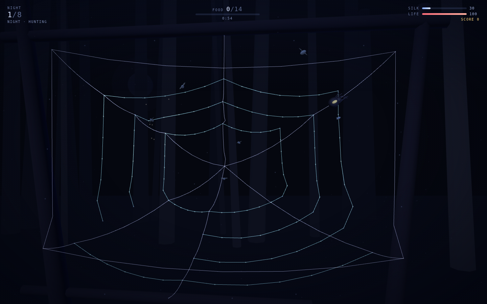
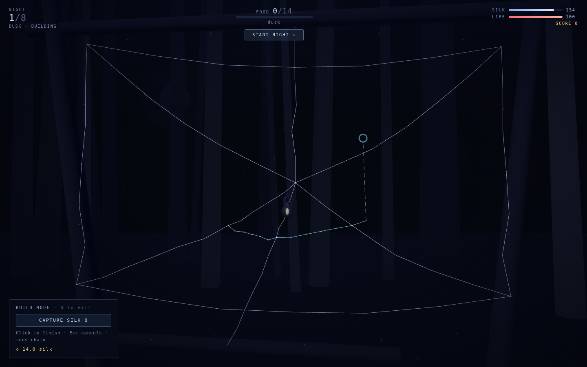
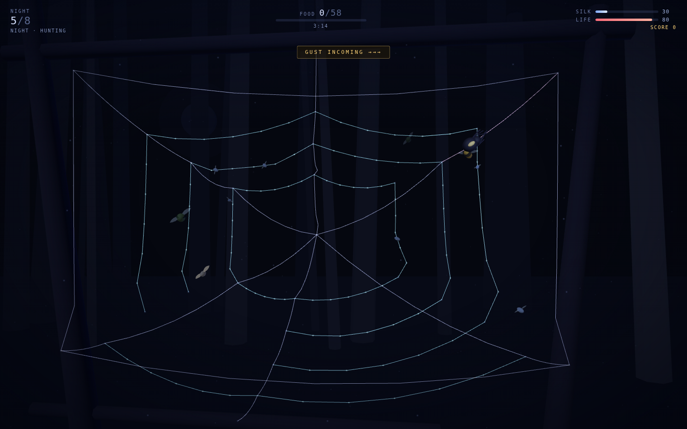

# Silkfall

A 3D orb-weaver survival game where **you build the level, then you hunt in it**.
Spin a web out of simulated silk across a gap between branches, then run its
strands to reach whatever flies into them — before the strand gives, and before
the wasps reach you.

| The web you spun | Prey snagged, wasp inbound |
|:---:|:---:|
|  |  |

| Build mode — dashed run, live cost | Gust warning, mid-wrap |
|:---:|:---:|
|  |  |

## Why it plays differently

Most games hand you a level. Here the level is your construction, it is
physically simulated, it degrades under use, and **your movement is confined to
your own geometry**. A pretty spiral with no radial highways is a web you cannot
patrol. Building badly is not punished by a validation error — it is punished by
a beetle tearing a hole through the corner you cut.

## The loop

```
DUSK   spend silk → spin frame and capture strands, repair last night's damage
NIGHT  prey flies in → snags → struggles, chewing through that strand →
       you run the graph to it → wrap → feed
       wasps hunt YOU · gusts tear the long spans
DAWN   food → silk. Meet the quota or lose life. Survive 8 nights.
```

## Mechanics

### The web is a real particle system

Nodes are particles shared by many strands; each strand owns the interior
particles of its own 6-segment rope. Distance constraints are solved across every
strand in one Gauss-Seidel pass, so a tug on a capture spiral travels into the
frame that holds it. Junctions carry a pre-tension memory of where they were
spun — without it the whole web slowly sinks into a hammock.

Two silks:

| | Cost / unit | Strength | Catches prey | Walk speed |
|---|---|---|---|---|
| **Frame** (violet) | 1.0 | 100 | no | full |
| **Capture** (cyan, dew-beaded) | 1.6 | 55 | yes | 78% |

**Structural validity is enforced.** A node exists only while silk still leads
back to a rim anchor. Cut the one strand holding a limb and the whole limb falls
— nodes, strands, and any prey stuck to it.

### Building

Click a node or a point on an existing strand, then click again to spin. Clicking
mid-strand splits it into a new junction, which is how a spiral gets pinned to a
radial. Runs chain: the endpoint becomes the next start, so a ring is one
continuous sequence of clicks. Building is allowed during the night too — repair
costs silk you would rather have spent on new capture area.

### Movement

The spider's position is `(strand, t)`. Input gives a direction; at each junction
it switches to the incident strand best aligned with where you are pushing. It
never leaves the silk. `Space` drops a dragline: the escape from a committed wasp
dive, and the only way to cross a gap you never built across — swing into another
strand and you latch onto it.

### Prey

| Species | Behaviour | Struggle | Food |
|---|---|---|---|
| **Midge** | drifts slowly | weak | 4 |
| **Moth** | fast, erratic | medium | 9 |
| **Beetle** | heavy, straight | violent — tears frames | 18 |
| **Wasp** | ignores the web, hunts the spider | — | 25 if you wrap it |

Snagged prey drags the local rope points, damages its strand, and emits a
vibration pulse that travels the graph by Dijkstra distance as a widening ring of
brightened silk. That is your sense organ. Reach it in time and wrap; too slow
and it tears free, taking the strand with it.

Wasps glow red for 0.7 s before committing to a dive — that window is the dodge.

### Pressure

- **Gusts** telegraph for three seconds, then damage every strand in proportion
  to its length. Long cheap spans suffer; short triangulated ones hold.
- **Hunger**: miss the night's food quota and you lose life at dawn.
- Eight nights, each with more prey, more wasps, and stronger wind.

## Controls

| Input | Action |
|---|---|
| `WASD` / arrows | run the silk |
| `Space` (hold) | dragline down · release to climb |
| `E` (hold) | wrap snagged prey · feed on a bundle |
| `B` | toggle build mode |
| Mouse | in build mode: click node/strand, click again to spin |
| `Q` | swap frame ↔ capture silk |
| `X` (hold) + click | cut a strand |
| `Esc` | cancel the current run |
| `Enter` | dismiss the briefing · start the night |
| `P` | pause · `M` mute |
| Right-drag / wheel | orbit / zoom |

Touch devices get an on-screen stick, DROP/WRAP/BUILD buttons, and tap-to-build.

## Running it

```bash
cd showcase/apps/silkfall
python3 -m http.server 8080
# open http://localhost:8080
```

ES modules need an HTTP server — `file://` will not work.

## Dependencies

None to install. Three.js r163 is vendored at `vendor/three.module.js`, and every
sound is synthesised at runtime with the Web Audio API — silk plucks are pitched
by strand length, so a long frame answers lower than a short capture thread.
Nothing is fetched from a network, so the game works offline.

## Layout

```
silkfall/
├── index.html          HUD and overlay panels
├── style.css
├── PRD.md              the design this was built from
├── src/
│   ├── main.js         state machine, night plan, game loop
│   ├── webmodel.js     nodes, strands, verlet solve, snapping, collapse
│   ├── webview.js      silk/dew/pulse rendering from the simulated points
│   ├── build.js        cursor resolution, strand splitting, cost quoting
│   ├── spider.js       graph traversal, dragline, legs
│   ├── prey.js         species, flight, snagging, struggle, wasp AI
│   ├── scene.js        night forest, moon, fog, spores
│   ├── hud.js          DOM readouts
│   ├── input.js        keyboard, pointer, touch stick
│   └── audio.js        runtime synthesis
└── vendor/three.module.js
```

## Tuning

Night difficulty lives in `NIGHT_PLAN` in `src/main.js` — quota, duration, spawn
interval, species weights, wasp and gust counts per night. Silk economy constants
(`SILK_MAX`, strand cost and strength) are in `src/main.js` and
`STRAND_TYPES` in `src/webmodel.js`. Physics feel — gravity, damping, solver
iterations, junction pre-tension — sits at the top of `src/webmodel.js`.
