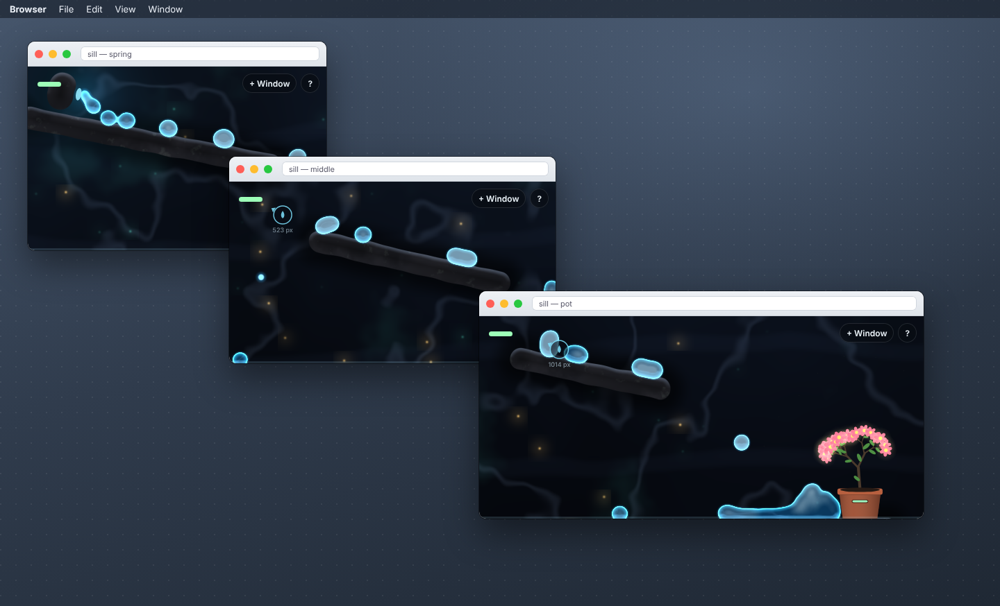
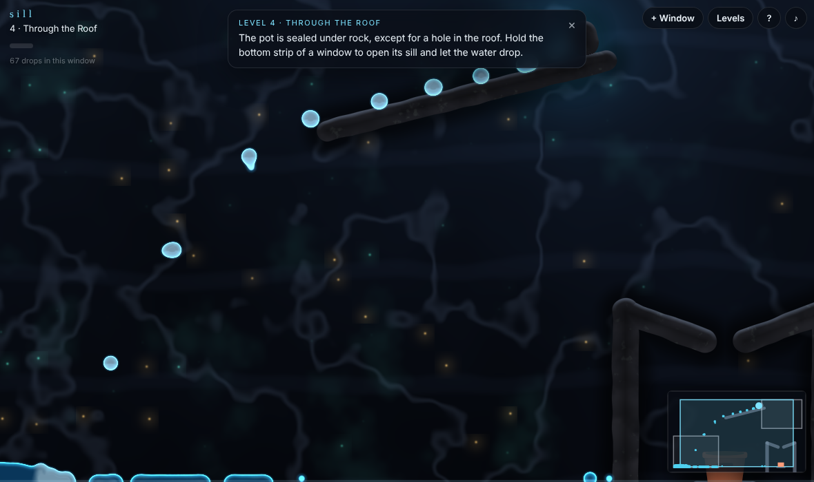
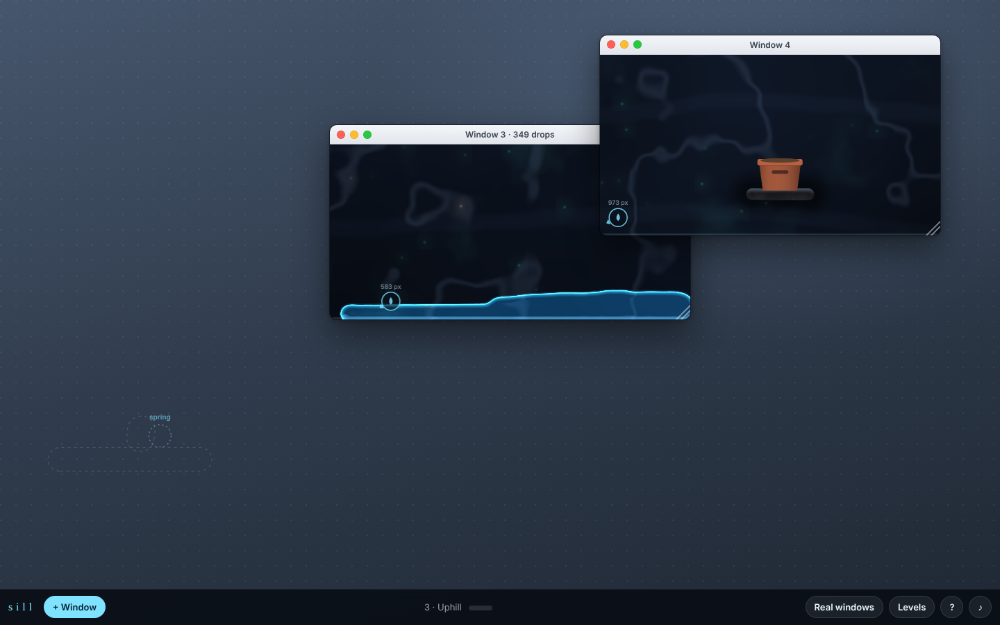
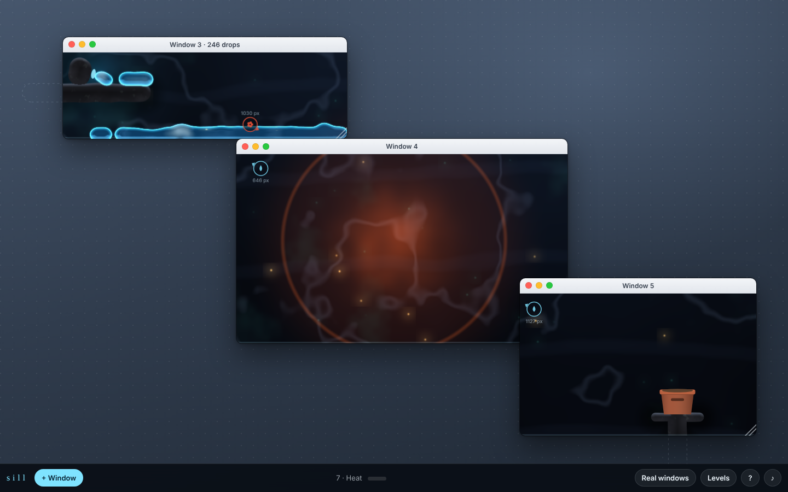
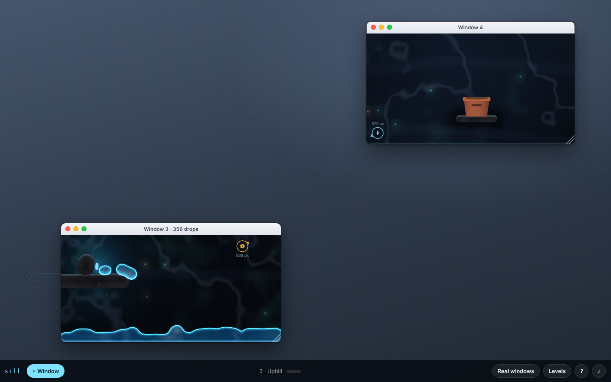
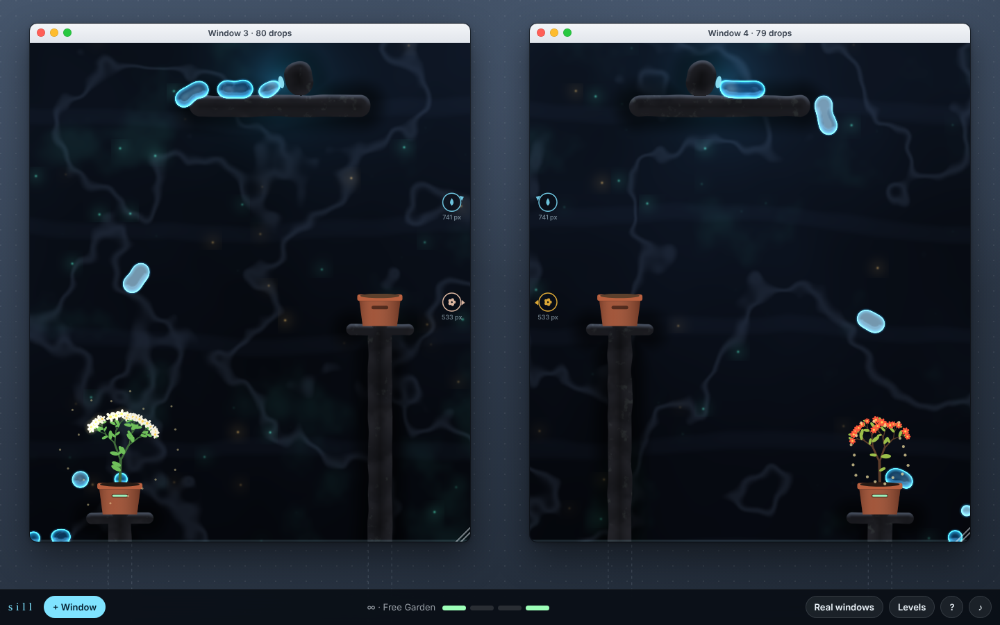
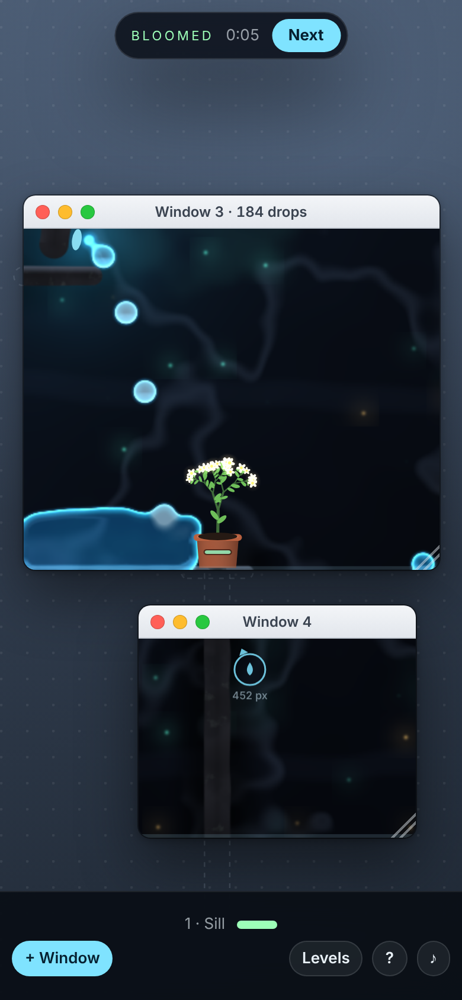

# Sill

**The water lives on your desktop, and your browser windows are the only thing
holding it.** Behind your monitor there is a cave with a spring in it. Each Sill
window shows the patch of cave directly behind wherever that window sits on your
screen. Water rests on window floors. To get it from the spring to the pots you
overlap windows into channels, drag a window upward to carry water uphill, and
close one to pour out whatever it held.

| Three real windows, one world | The full-size window, with its minimap |
|:---:|:---:|
|  |  |
| **Carrying water uphill** (simulated desktop) | **Heat** turns lingering water to steam |
|  |  |
| **Uphill**, before the lift | **Free Garden** |
|  |  |

<p align="center"></p>

## Why it exists

The other 67 projects here each live in one rectangle and ignore where that
rectangle is. Move any of them across the monitor and nothing changes. Sill is
the opposite: **the window's position is the controller.** You play by grabbing
title bars.

## The rules

1. **Screen space is world space.** Rocks, the spring, pots and every drop of
   water have a position in screen pixels. A window draws the world at its own
   `[screenX, screenY, innerWidth, innerHeight]`, so two overlapping windows
   draw identical pixels in the overlap and the cave looks continuous across
   them.
2. **Windows are the only containers.** Water can only be inside the union of
   visible windows. Each window's left, right and bottom edges are walls. **Its
   top is open.**
3. **No window, no floor.** Close, minimise or hide a window (switching tabs
   counts) and its water falls through the void. It lands in whatever window is
   below, or drops off the bottom of the screen and counts as spilled.
4. **Gravity only goes down. Windows can go up.** Drag a window up and the water
   in it rides up with it. That's the only way to reach a pot that sits above
   its spring.
5. **The spring only runs while a window covers it.**
6. **The sill opens.** Hold the bottom strip of a window (or hold Space) and a
   gap opens in its floor under the pointer.
7. **Pots drink.** Each pot grows a plant as it fills and blooms when full. When
   every pot blooms, the level is done.

Seven levels (Sill, Downstream, Uphill, Through the Roof, Two Gardens, Over the
Wall, Heat), then Free Garden: two springs, four pots, no clock. Layouts are
fractions of your screen, so they fit any monitor.

## Running it

```bash
cd showcase/apps/sill
python3 -m http.server 8080
# open http://localhost:8080
```

No build, no dependencies, no network requests. It needs an HTTP server because
of ES modules and the SharedWorker.

The intro offers two modes:

* **Use real windows** (desktop Chrome, Edge, Firefox, Safari). This tab becomes
  the first window. **+ Window** opens more as pop-ups beside it (allow pop-ups
  if asked), or open the same address in another window yourself. Every Sill
  window on the origin joins the same world.
* **Simulated desktop** (phones, tablets, embedded views, or a preview). The
  page becomes a desktop with fake windows you can drag, resize, minimise,
  maximise and close, plus a taskbar. It runs the same world, renderer and
  rules in-page.

Direct links: `?mode=real`, `?mode=desk`.

### Controls

| | |
|---|---|
| Drag a title bar | move the window, and the water with it |
| Resize a window | move its walls and floor |
| Minimise / close | drop everything it held |
| Hold the bottom strip, or Space | open the sill under the pointer |
| Drag inside a window | stir the water |

Each real window's tab title and favicon show how many drops that window is
holding.

## How it works

**One world, many windows.** A module `SharedWorker`
([`js/sim-worker.js`](js/sim-worker.js)) owns the world and steps it at a fixed
60 Hz on its own timer. No window's `requestAnimationFrame` drives it, so hiding
a window can't stall it. Each window posts its content rect every frame (every
400 ms while hidden, since hidden pages get no animation frames). The worker
broadcasts particle positions, which window each drop belongs to, the rects it
used, pot fills and events. A window that goes 1.5 s without reporting is gone,
which catches crashed tabs that never sent `bye`.

**Where is this window?**
`contentX = screenX + (outerWidth − innerWidth)/2` and
`contentY = screenY + (outerHeight − innerHeight) − (outerWidth − innerWidth)/2`.
That allows for side borders and for pop-ups having less chrome than tabbed
windows.

**Lag compensation.** A window knows where it is a frame or two before the
worker's world reflects it. When drawing, it shifts the drops homed in itself by
`currentRect − rectTheWorkerUsed`, so carried water stays on the floor while you
drag instead of sliding behind it.

**Fluid.** Clavet, Beaudoin & Poulin (2005) double-density relaxation: pressure
and near-pressure give cohesion and surface tension without a pressure solve. It
uses a spatial hash at the 16 px interaction radius, Clavet's pairwise
viscosity, and 2 substeps per frame. Rest density 3, stiffness 25 000, near
stiffness 25 000 and viscosity σ = 4 came from two sweeps covering 243
settings: a settled pool's mean jitter fell from ~35 px/s to ~10 px/s.

**Moving walls.** A one-pass relaxation is compressible, and incompressible
water isn't. With a pure projection, a fast lift compressed the pool until it
burst out of the open top: a jerky 400 px lift kept only 242 of 388 drops. Now a
rising floor lifts every drop homed in its window as a block, and a sideways
move carries 80% rigidly and leaves 20% to the walls, so there is still slosh.
The same lift keeps 391 of 391. Velocity a wall hands a drop is capped at
520 px/s, so a hard stop splashes rather than launching the pool.

**Rendering.** One WebGL context. Pass 1 splats drops as Gaussian point sprites
into a half-resolution density texture. Pass 2 is a full-screen shader evaluated
**in screen coordinates**: cave (fbm noise, mineral seams, breathing spores),
rocks (capsule SDFs with rim light and ambient occlusion), metaball water
(threshold, refraction, meniscus rim, foam from speed) and heat shimmer. The
frame is blitted into each window's 2D canvas, and the pots, plants
(deterministic per seed, so every window draws the same plant), arrows to
off-window things, steam and sparks go on top. Resolution backs off on slow
frames.

## Bench

`node scripts/solve.mjs` plays every level headlessly, dragging windows along
keyframed paths the way a hand would. It then checks that a single maximised
window can't do the uphill ones:

```
Scripted solutions (windows dragged along keyframed paths):
  PASS  Sill               pots 112/112          done 4.8s   spilled 0
  PASS  Downstream         pots 112/112          done 4.7s   spilled 0
  PASS  Uphill             pots 112/112          done 16.1s  spilled 0
  PASS  Through the Roof   pots 112/112          done 14.7s  spilled 309
  PASS  Two Gardens        pots 112/112 112/112  done 21.3s  spilled 0
  PASS  Over the Wall      pots 112/112          done 19.0s  spilled 0
  PASS  Heat               pots 112/112          done 16.0s  spilled 0
One maximised window, 40 s, no dragging:
  PASS  Sill               pots 0/112            (no pot fills)
  PASS  Uphill             pots 0/112            (no pot fills)
  PASS  Over the Wall      pots 0/112            (no pot fills)
  PASS  Two Gardens        pots 0/112 1/112      (not every pot fills)
  PASS  Heat               pots 1/112            (no pot fills)
```

(Through the Roof's spill is the overflow after the pot is full, which runs down
inside the sealed chamber.)

`node scripts/windows.mjs` (with a server on :8090) opens three separate pages
in one browser and checks the real-window path end to end: SharedWorker, shared
world, per-window rendering.

```
PASS three windows share one world
PASS water crossed from A into B through the overlap
PASS the pot drank
PASS C holds nothing (no spring, no overlap)
PASS closing A removed it from the world
PASS closing A dropped its water
PASS no page errors
```

A headless browser has no window manager, so these pages and the real-window
screenshots are told their screen position with `?rect=x,y,w,h` and
`?screen=x,y,w,h`. The hero image is three real Sill pages captured separately
and placed on a drawn desktop at exactly those rects. `node scripts/screens.mjs`
regenerates every screenshot.

## Known limits

* Windows at **different page-zoom levels** misalign, because `screenX` and
  `innerWidth` scale differently.
* Some window managers don't update `screenX` until a drag ends. The water then
  catches up when you let go.
* Real windows need `SharedWorker`, which phones don't have. They get the
  simulated desktop.

## Files

```
index.html, style.css
js/main.js        mode selection and intro
js/world.js       the world: panes, containment, carry, springs, pots, heat
js/fluid.js       double-density relaxation + spatial hash
js/levels.js      levels as fractions of the screen
js/sim-worker.js  the SharedWorker that owns the world in real-window mode
js/real.js        a real window: rect tracking, HUD, minimap, favicon
js/desk.js        the simulated desktop
js/renderer.js    WebGL: density splats + screen-space composite
js/overlay.js     pots, plants, arrows, sill strip, effects
js/plants.js      deterministic plant growth
js/sound.js       synthesised cues
js/ui.js          levels menu, completion card, help, progress
scripts/          solve.mjs (level bench), windows.mjs (multi-page test), screens.mjs
PRD.md            the plan this was built from
```
