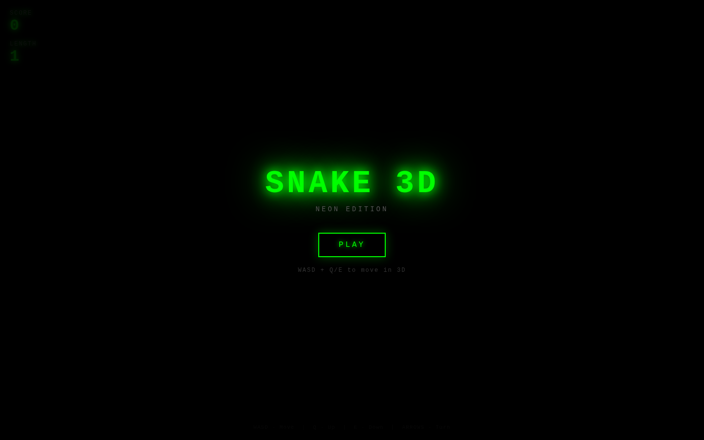
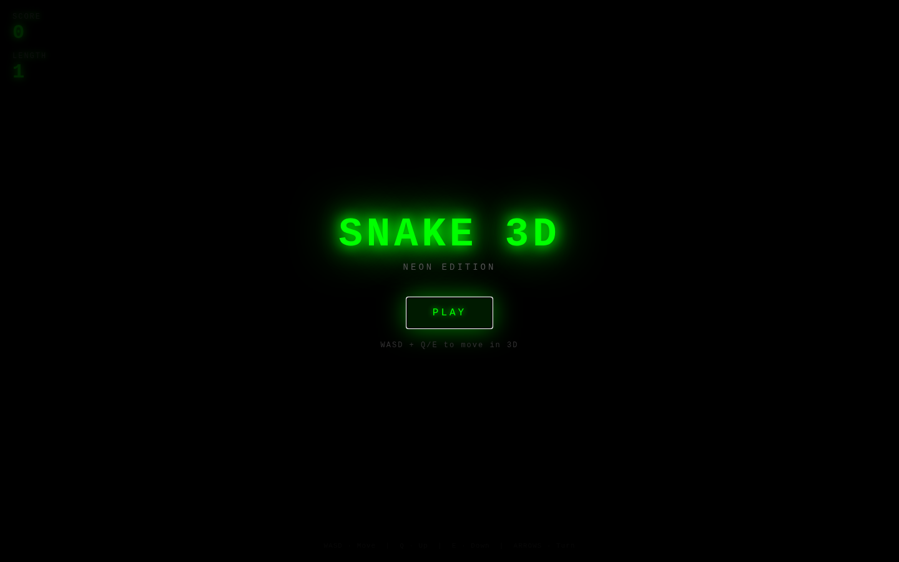

# Neon Snake 3D

A fully 3D take on classic Snake, rendered with Three.js in a glowing neon aesthetic. Guide your snake through a wireframe cube, eating pulsing magenta orbs to grow. Hit a wall or yourself and it's game over.

| Title screen | In-game |
|:---:|:---:|
|  |  |

## How to play

```bash
cd showcase/apps/snake-3d
python3 -m http.server 8080
# open http://localhost:8080
```

### Controls

| Key | Action |
|-----|--------|
| W / ↑ | Move forward (−Z) |
| S / ↓ | Move backward (+Z) |
| A / ← | Move left (−X) |
| D / → | Move right (+X) |
| Q | Move up (+Y) |
| E | Move down (−Y) |

## Features

- True 3D movement across a 25×25×25 grid
- Neon glow materials with emissive lighting
- Pulsing, spinning food orb with point light
- Particle burst on eating food
- Progressive speed-up every 5 food eaten
- Slow orbiting camera adds depth perception
- Score and length HUD

## Stack

- Vanilla JS (ES modules)
- [Three.js r163](https://threejs.org/), vendored in `vendor/` and wired through an importmap — runs fully offline
- No build step — served with `python3 -m http.server`
