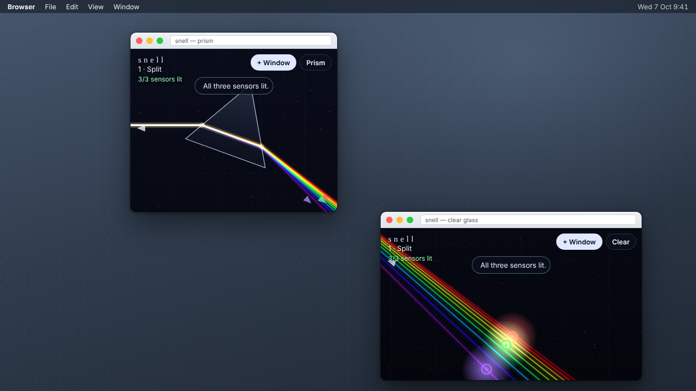
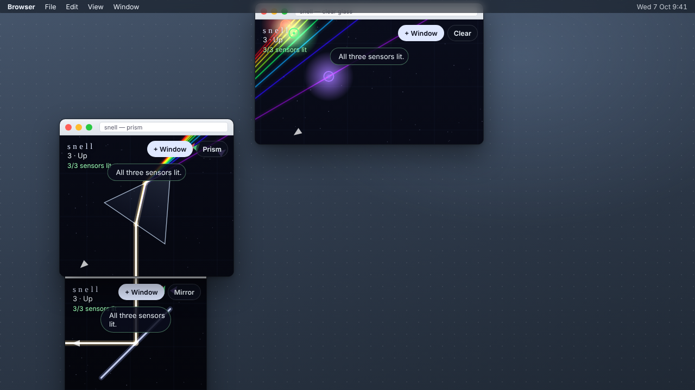

# Snell

**One beam of white light crosses your desktop, and every browser window is a
piece of optics.** Each Snell window shows the part of your screen it sits on,
and carries a glass prism, a mirror or clear glass at its centre. The beam
enters from the left edge of your monitor. It bends at every glass face by
Snell's law, splits into a spectrum because each wavelength bends by a
different amount, and keeps going across the desktop to the next window. You
can only see it where a window is. Route the colours onto three sensors fixed to
your screen.

| Split: one prism window, one clear window | Up: mirror, prism, clear glass |
|:---:|:---:|
|  |  |

It's the sibling of [Sill](../sill/). Same idea, separate windows that share one
world, but light instead of water. Light crosses the whole screen at once, so
moving one window re-routes everything downstream of it immediately.

## Running it

```bash
cd showcase/apps/snell
python3 -m http.server 8080
# open http://localhost:8080 in a desktop browser
```

Press **+ Window** to open more windows (allow pop-ups), or open the same
address in another window yourself. All Snell windows on the origin share one
light path. No build, no dependencies, no network requests.

| | |
|---|---|
| Drag a window | move its optic |
| Wheel, horizontal drag, ← → | rotate this window's optic |
| **M**, or the kind button | cycle prism → mirror → clear glass |
| ‹ › | change level (every window follows) |

## How it works

* **Where is this window?** It uses the same calculation as Sill:
  `screenX/screenY` plus half the side chrome. That accounts for pop-ups
  having less chrome than tabbed windows.
* **No authority.** Each window broadcasts `{rect, kind, rotation}` on a
  `BroadcastChannel` every frame (every 300 ms while hidden). Every window
  traces the identical light path from the shared list and draws the part that
  crosses its own rect, so there's no worker, no leader and no lag
  compensation. A window that goes 1.2 s without reporting, or is hidden,
  stops being optics.
* **Optics.** Nine wavelengths from 400 to 680 nm are each traced as a ray.
  Glass uses exaggerated Cauchy dispersion, `n(λ) = 1.45 + 0.021/λ²` with λ in
  µm, so one prism fans the spectrum about 7°. Every face applies Snell's law,
  and total internal reflection takes over past the critical angle. The rays
  are drawn additively, so where all nine overlap they sum back to white.
* **Levels are solvable by construction.** `node scripts/levels.mjs` places
  reference windows, traces the real dispersion, and prints where red (645 nm),
  green (540 nm) and violet (400 nm) land. Those positions are the sensors. A
  sensor lights when a ray in its band passes within 12 px.

The screenshots come from real Snell pages placed on a drawn desktop at the
reference positions, with `?rect=` and `?screen=` telling each page where it
is, because the build container has no window manager. Every reference
solution lit 3/3 sensors.

## Limits

Built against a 30-minute deadline, so it has no phone mode (it needs desktop
windows), no sound, three levels, and level 2's red and green sensors sit close
together. Windows at different page-zoom levels misalign.
