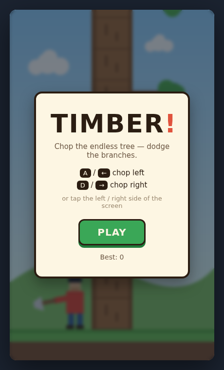
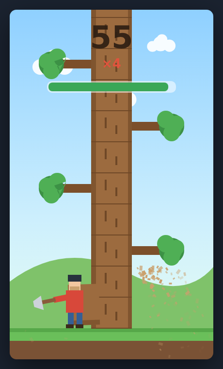

# Timber!

A fast, one-more-go arcade chopper. You're a lumberjack at the base of an
endless tree — tap **left** or **right** to chop and hop to that side. Branches
grow from the trunk at random; get caught on the same side as a branch when you
chop and you're squashed. A timer drains constantly and tops up with every
chop, so hesitation kills as surely as a misjudged branch.

| Title screen | Mid-chop (score 19) |
|:---:|:---:|
|  |  |

## How to play

| Action | Keys | Touch |
|--------|------|-------|
| Chop left | `A` / `←` | tap the left half of the screen |
| Chop right | `D` / `→` | tap the right half of the screen |
| Start / retry | `Space` / `Enter` / click | tap |

- Each chop scores points and refills the timer a little.
- **Combo multiplier:** keep chopping in a steady rhythm to build a streak —
  the multiplier climbs to **×5**, so points come fastest when you stay calm and
  keep the axe swinging. Pause too long and the streak resets.
- A branch on **your** side when you chop = **squashed**.
- Let the timer empty = **time's up**.
- Difficulty ramps with your score: the timer drains faster, refills less, and
  branches get denser (but a fair path always exists — two branched blocks never
  stack, so you can always read the next safe side).

Your best score is saved in `localStorage`.

## Run it

It's a static site — serve the folder and open it:

```bash
cd showcase/apps/timber
python -m http.server 8080
# open http://localhost:8080
```

ES modules need an HTTP server; opening `index.html` via `file://` won't work.

## How it works

Vanilla JS (ES modules) + Canvas 2D, no build step and no dependencies.

| File | Responsibility |
|------|----------------|
| `index.html` | Canvas + title / game-over overlays |
| `style.css` | Overlay cards, buttons, layout |
| `game.js` | Rules: the trunk-segment stack, branch spawning, scoring, timer, win/lose |
| `render.js` | All drawing + juice: trunk, branches, lumberjack, wood chips, screen shake, falling logs, HUD |
| `input.js` | Keyboard + touch → chop/start intents |
| `main.js` | Fixed-ish `requestAnimationFrame` loop, overlay state, best-score persistence |

The trunk is a stack of segments where `segments[0]` is the block being chopped
and the stack grows upward. The block at `segments[1]` is the one that can squash
you, so each chop checks its branch against your chosen side before shifting the
stack down and spawning a new top segment. New segments never carry a branch if
the block below them already does — that single rule guarantees the run is always
survivable with correct play.

See [`PRD.md`](./PRD.md) for the full product spec.
