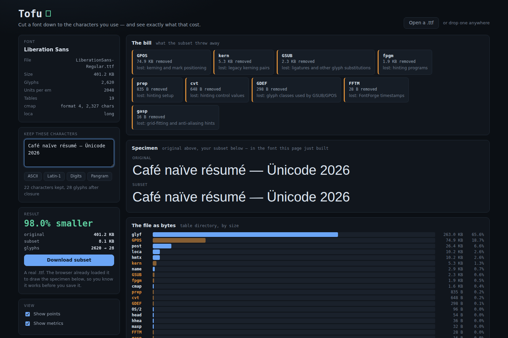
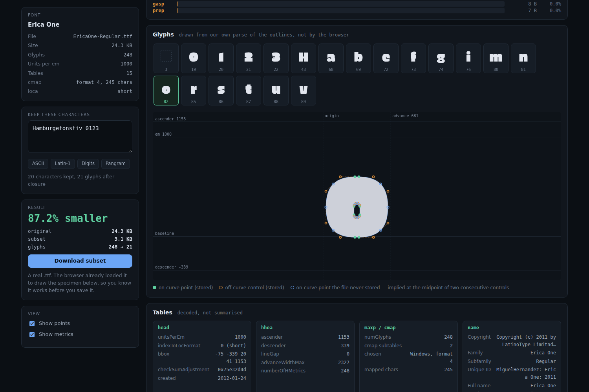
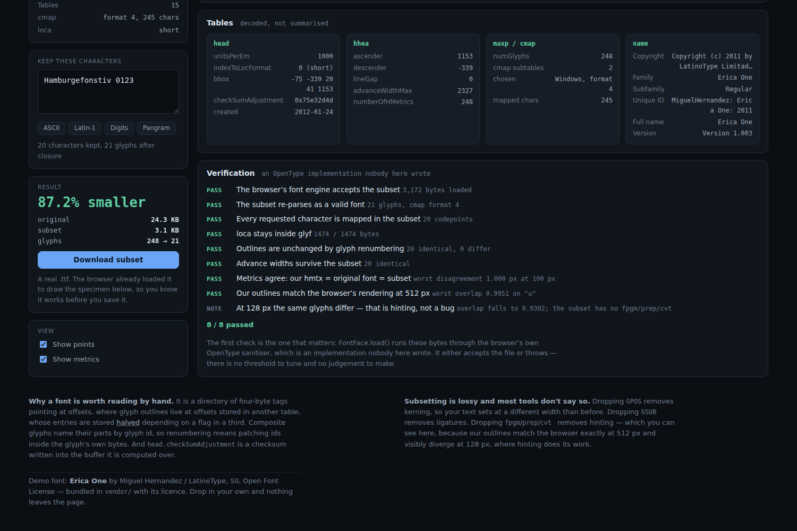
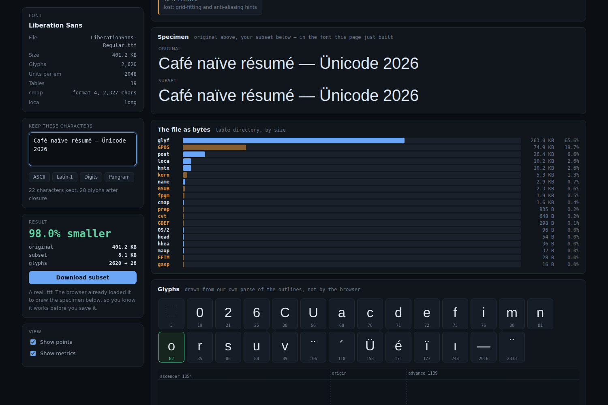
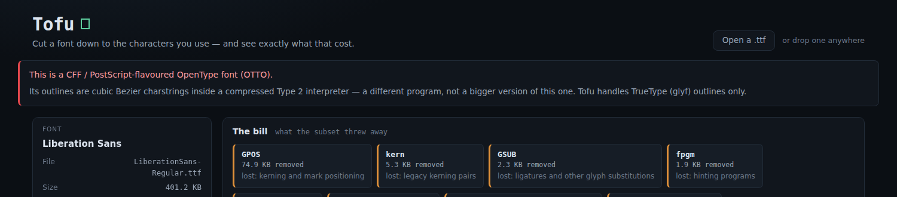

# Tofu

Drop in a `.ttf`, read the bytes a stranger laid out, cut the font down to the
characters you actually use — and get told exactly what that cost.

**Tofu** is the term of art for the □ you get when a font has no glyph for a
character. It is the precise failure mode of a bad subset, and the thing this
tool exists to avoid producing.

| A real 401 KB font, subset to 8.1 KB | The outline, drawn from our own parse |
|:---:|:---:|
|  |  |

| Verification | What it threw away |
|:---:|:---:|
|  |  |

See [`PRD.md`](./PRD.md) for the full spec.

## What it does

- **Reads the container by hand.** The table directory, `head`, `hhea`, `maxp`,
  `hmtx`, `loca`, `cmap` (formats 4 and 12), `name`, `OS/2` — no library, no
  browser decoder.
- **Reconstructs the outlines itself.** Quadratic contours with on-curve and
  off-curve points, the **implied on-curve midpoints** the file never stores, and
  composite glyphs resolved recursively through their transforms. The glyph view
  draws all three kinds of point, so a parsing error would be visible.
- **Builds a new font.** Glyph closure over the retained characters, glyph
  renumbering with composite component ids patched *inside* each glyph's bytes,
  rebuilt `loca` and `glyf`, a freshly synthesized `cmap`, trimmed `hmtx`,
  patched `maxp`/`hhea`/`head`, correct table checksums and the self-referential
  `checkSumAdjustment`.
- **Names the cost.** Every dropped table with the capability that went with it:
  `GPOS` is kerning, `GSUB` is ligatures, `fpgm`/`prep`/`cvt ` are hinting.
- **Hands you the file.** A real `.ttf` — and the browser has already loaded it
  to render the specimen on the page, so you know it works before you save it.

Liberation Sans goes from **401.2 KB to 8.1 KB** (98.0% smaller) for a line of
accented Latin, and the specimen renders identically to the original.

## How to run

Static site, no build step, no dependencies:

```bash
cd showcase/apps/tofu
python -m http.server 8080
# open http://localhost:8080
```

Nothing leaves the page — the font you drop is read in the browser.

## The oracle

Every project in this line needs a way to be proved wrong. A font is the rare
artifact where an independent implementation is already sitting in the room:

1. **The browser's own OpenType sanitiser votes on the bytes.**
   `new FontFace(name, subsetBytes).load()` either resolves or throws. It rejects
   a bad table directory, an out-of-range `loca`, a malformed `cmap`, an
   inconsistent `maxp`. No threshold, no judgement call — it loads or it doesn't.
2. **Per-glyph raster agreement.** Each glyph is filled from *our own* parsed
   contours via `Path2D`, and the same character is filled by the browser using
   *our* subset. At 512 px the two are **pixel-identical** — measured across
   Liberation Sans, every glyph came back at IoU 1.0000 with identical areas.
3. **Metric agreement, three ways.** Our `hmtx` advance scaled by
   `size / unitsPerEm` = `measureText` under the original = `measureText` under
   the subset.
4. **Structural round-trip.** The subset is re-parsed by our own reader and every
   outline and advance is compared against the original.

### One finding worth stating

At 512 px our outlines and the browser's rendering agree exactly. At 128 px the
same glyphs fall to 0.71–0.99 overlap — and **that is hinting, not a bug**. The
browser snaps stems to the pixel grid at small sizes, which is precisely the
capability `fpgm`/`prep`/`cvt ` provide and precisely what the subset drops. The
app reports this separately as a note rather than a failure, because it is the
cost being measured rather than an error being hidden. No disagreeing pixel was
ever more than one pixel away from the other shape at any size.

## What it refuses, and why

Refusing with a reason is cheap; half-parsing and emitting something plausible is
not.

- **CFF / PostScript-flavoured OpenType (`OTTO`)** — cubic outlines inside a
  compressed Type 2 charstring interpreter. A different program, not a bigger
  version of this one.
- **TrueType Collections (`ttcf`)** and **WOFF/WOFF2** — containers around the
  format rather than the format.
- A file whose `head.magicNumber`, table directory or `loca` is inconsistent gets
  a specific diagnostic naming the field and the offset.



## The three things that bite

1. **Composite glyphs name their parts by glyph id.** Renumber the glyphs and
   those ids must be patched *inside* the glyph's own bytes, or the subset
   assembles accents out of whatever now sits at the old index. Verified: 6
   components patched for a Latin-1 subset of Liberation Sans.
2. **Short `loca` stores offsets halved**, so every glyph must be padded to an
   even length or the offsets cannot address it.
3. **`head.checkSumAdjustment` is a checksum written into the buffer it is
   computed over.** Zero it, sum the whole file, subtract from `0xB1B0AFBA`.

And one deliberate escape: `cmap` format 4's `idRangeOffset` is a byte offset
measured *from its own address* into a trailing array — the nastiest layout in
the format. Emitting only segments with `idRangeOffset = 0` and a computed
`idDelta` is fully legal, costs a few extra segments, and removes that pointer
arithmetic entirely.

## Files

```
tofu/
├── index.html
├── style.css
├── main.js           UI wiring, drag-and-drop, live re-subsetting
├── js/
│   ├── sfnt.js       table directory + head tables + cmap, with real diagnostics
│   ├── glyf.js       outlines, implied midpoints, composites, glyph closure
│   ├── subset.js     renumbering, table rebuilding, checksums, serialization
│   ├── render.js     byte map, glyph palette, outline view
│   └── verify.js     the oracle suite
└── vendor/
    ├── EricaOne-Regular.ttf   demo font, 24 KB
    └── EricaOne-OFL.txt       its licence
```

Demo font: **Erica One** by Miguel Hernandez / LatinoType, under the SIL Open
Font License, bundled with its licence text. No other dependencies, no build, no
network calls.
