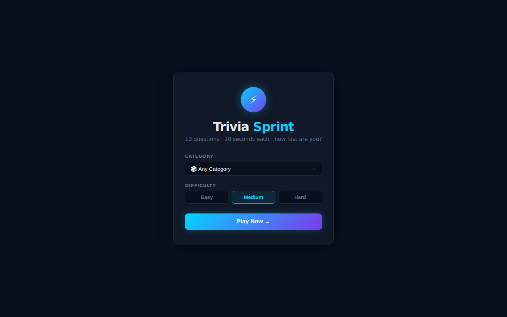
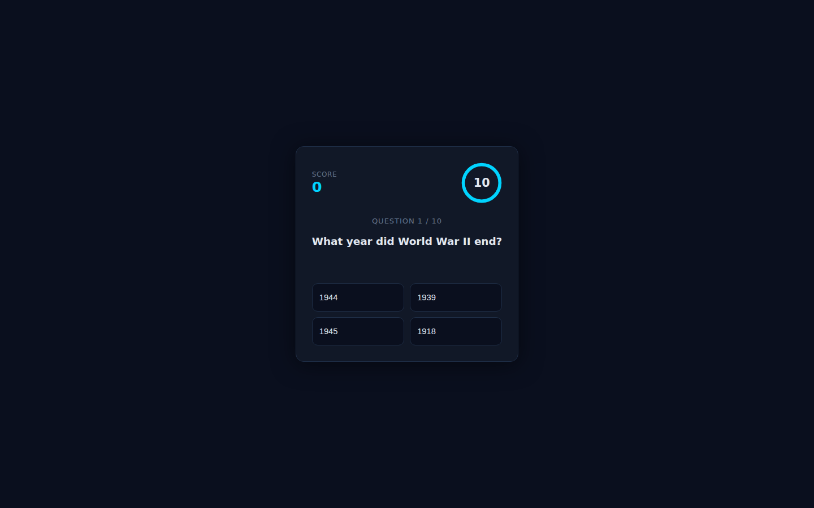

# Trivia Sprint

Fast-paced trivia game — 10 questions, 10 seconds each. Pick a category and difficulty, race the clock, and beat your personal best. Questions are fetched live from the [Open Trivia DB](https://opentdb.com/) (free, no API key). A built-in question bank kicks in automatically if the API is unreachable.

| Start screen | Game in progress |
|:---:|:---:|
|  |  |

## Features

- **10 categories** — General Knowledge, Science, Computers, History, Geography, Film, Music, Video Games, Sports, Anime
- **3 difficulty levels** — Easy / Medium / Hard
- **10-second countdown** per question with animated ring timer (turns red in the final 3 s)
- **Scoring** — 100 pts per correct answer + up to 50 pts time bonus
- **Streak badge** — 🔥 fires when you chain 2+ correct answers
- **Personal best** persisted in localStorage
- **Answer review** at the end — see every question, your answer, and the correct answer
- Fallback question bank (20 built-in questions) when the API is unavailable

## How to run

```bash
cd showcase/apps/trivia-sprint
python3 -m http.server 8080
# open http://localhost:8080
```

No build step required — vanilla JS ES modules, served statically.

## Stack

- Vanilla JS (ES Modules)
- CSS3 (custom properties, grid, keyframe animations)
- SVG countdown ring
- Open Trivia DB API (`opentdb.com`)
- localStorage for personal best
