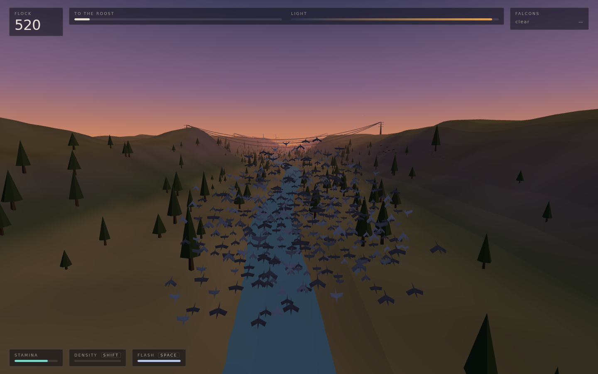
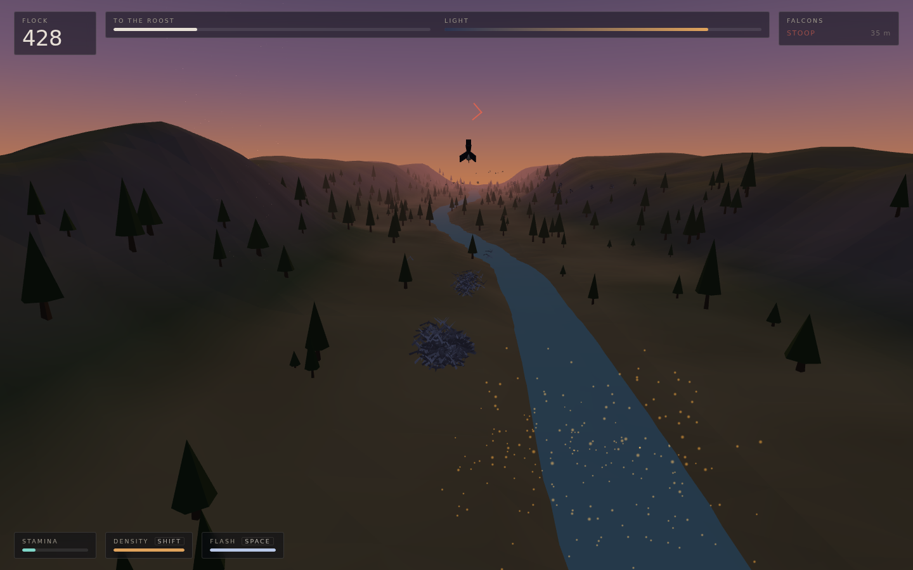
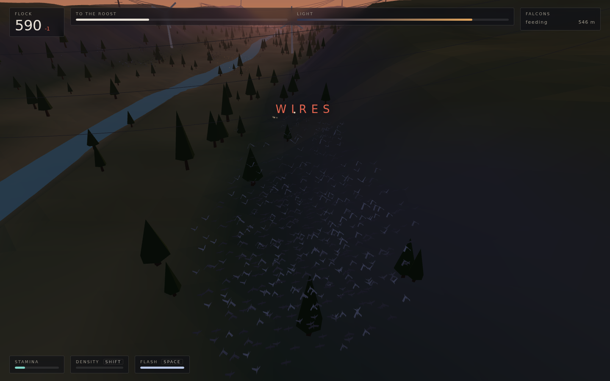
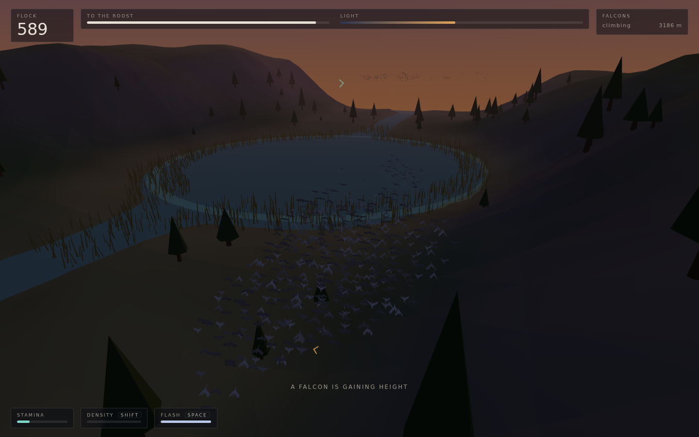

# Vesper

**You are not a bird in the flock. You are the flock.**

A 3D dusk-flight game where the thing you steer is a murmuration of up to about
1,800 individually simulated starlings, and the number of birds still in it is
the only health bar you get. There is no player object anywhere in the scene —
the avatar is an emergent property of a boid simulation, so every stat the game
tracks is a statistic *of a population*: how many are left, how tightly they are
packed, and how many have drifted far enough from the mass to be worth a
peregrine's attention.

| The murmuration | The black sun, and a peregrine committed to a stoop |
|:---:|:---:|
|  |  |

| Four hundred kilovolts across the valley | The reedbed, with the light nearly gone |
|:---:|:---:|
|  |  |

## The idea

Three things follow from making the flock the avatar, and they are the whole game:

- **Health is mass.** Birds are the only resource. Falcons eat them, wires cut
  them out of the air, and the dark takes whoever has drifted furthest from the
  centre. You get them back by sweeping up the wild flocks circling the water
  meadows on your way down the valley.
- **Defence is a shape, not a button.** A peregrine's strike success collapses as
  local prey density rises — the confusion effect. So the defensive state here is
  *density*, a continuous quantity you hold on `SHIFT`. Tight is the "black sun":
  roughly half the kill probability, and 62% of the speed, a heavier stamina
  burn, and an absolute catastrophe in a wire span.
- **The best move is a shape change made on one frame.** Flash expansion
  (`SPACE`) blows the murmuration apart. Time it inside the last 0.6 s of a stoop
  and the falcon closes on air. Fire early and it re-locks on the stragglers your
  own panic just created.

Score is the number of birds that make it into the reeds, so a cautious run that
arrives small scores worse than a greedy one that survives.

## Running it

```bash
cd showcase/apps/vesper
python -m http.server 8080
# open http://localhost:8080
```

No build step, no dependencies to install, no network calls. Three.js is vendored
in `vendor/`, and terrain, birds, sky, water and every sound are generated at
load — there are no asset files at all.

## Controls

| Input | Action |
|---|---|
| `W` / `S` or `↑` / `↓` | climb and dive |
| `A` / `D` or `←` / `→` | bank the flock |
| `SHIFT` (hold) | tighten — density up, speed down, confusion up |
| `SPACE` | flash expansion |
| `P` / `Esc` | pause |
| drag | steer with a mouse or a finger; a second finger tightens, double-tap scatters |

## The three nights

| # | Name | What it adds | Falcons | ★★★ |
|---|---|---|---|---|
| 1 | **Low Sun** | steering, density, recruiting | 1, timid | 780 birds |
| 2 | **The Span** | transmission wires, turbines, crosswind | 2 | 1,040 birds |
| 3 | **Black Sun** | three falcons working opposite sides, a hard crosswind, an early dusk | 3 | 1,480 birds |

Each night is one continuous flight down a valley corridor. Nights unlock as you
star them, and your best count per night is kept in `localStorage`.

## How it works

### The flock (`js/flock.js`)

Reynolds boids — separation, alignment, cohesion — over a uniform spatial hash,
plus five game rules:

| Force | Why it is there |
|---|---|
| **Lead steering** | The player rotates a *heading*, and birds steer their velocity toward it. Seeking a point instead makes a flock orbit that point beautifully and travel nowhere; this was the single most important thing to get right. |
| **Predator avoidance** | Inverse-square repulsion from each falcon, strong enough that a stoop shreds your formation whether or not it kills. |
| **Flash expansion** | A radial impulse from the centroid decaying over 0.9 s. |
| **Fatigue** | Per-bird stamina scales that bird's lead weight, so a tired bird slides backwards out of the mass and becomes a straggler — which is exactly what a falcon is looking for. |
| **Terrain avoidance** | Clearance force off the ground; the ridges are the edge of the level. |

Everything lives in flat `Float32Array`s and the per-frame loop allocates
nothing, because at a thousand-plus birds the garbage collector is the only thing
that can realistically ruin the frame budget. Neighbours come from a hashed
uniform grid with a 24-neighbour cap; the whole step measures ~2 ms for 1,000
birds.

Two derived quantities drive the game: **exposure** (each bird's distance from
the centroid, normalised) and **local density** (crowding within 10 m).

### The falcon (`js/falcon.js`)

Six states, all readable from the air, because the counter to a stoop is timing
and timing needs a tell:

`PATROL` → `CLIMB` (a rising cry) → `LOCK` (HUD bearing arc) → `STOOP` (62 m/s,
cannot retarget inside 40 m) → strike → `RECOVER`.

Target choice is weighted by `exposure³`, so stragglers are overwhelmingly
preferred. The strike resolves as

```
P(kill) = 0.92 × (1 − confusion) × (0.35 + 0.9 × exposure) × (1 − timidity)
```

where `confusion` runs from 0.14 in a loose sheet to 0.80 in the black sun. A
flash expansion inside the window is an unconditional miss.

### Attrition that is not a falcon

- **Wires.** Conductors are resolved per bird against the catenary of each span,
  so flying through one takes the *slice* of the flock that intersected it —
  about 11% of a loose flock at conductor height in testing. You get one honest
  warning naming the height band on your current track; the pylons are visible
  from far off, the wires are not.
- **Turbines.** Per-bird test against the swept disc and the current blade angle.
- **The dark.** Below 16% light, birds start losing the flock outright, worst for
  whoever is most exposed. The clock is the real antagonist.

### Rendering (`js/birds.js`)

The entire murmuration is one `InstancedMesh` and one draw call. Wing flap is a
per-instance phase evaluated in the vertex shader; the CPU only writes
orientation matrices, built by hand from the velocity basis plus a bank angle
that follows lateral acceleration. Dusk is a single normalised `light` value that
drives the sky shader, the fog, the sun, the bird tint *and* the survival rule,
so the danger is legible as colour.

## Tuning

Every number lives in `js/config.js` — flock forces, stamina rates, falcon
timings and probabilities, the light curve, and the three night definitions
(length, bird counts, wild flocks, swarms, thermals, pylon spans, turbines, star
thresholds). The simulation reads them all at runtime, so the game can be
rebalanced without touching `js/flock.js`.

`window.vesper` exposes the game state, the flock arrays and a `game.timeScale`
sub-stepping multiplier, which is how the screenshots and the balance tests in
this project were produced.

## Performance

- One draw call for the flock, instanced trees and reeds for everything else.
- Boid step ≈ 2 ms at 1,000 birds, ≈ 4 ms at 1,800.
- Terrain is a single non-indexed vertex-coloured mesh generated at load.

See [PRD.md](PRD.md) for the full design document.
