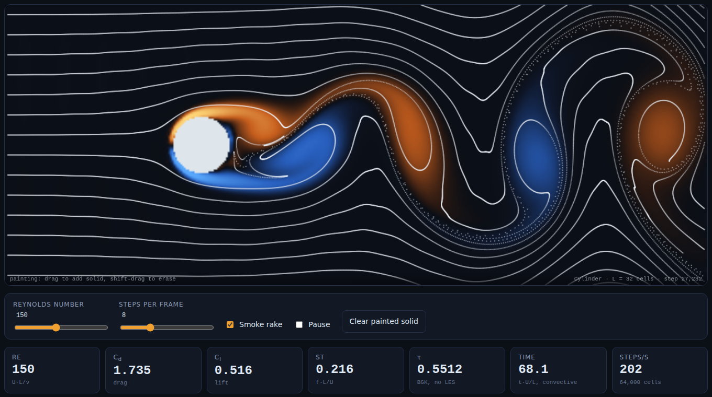
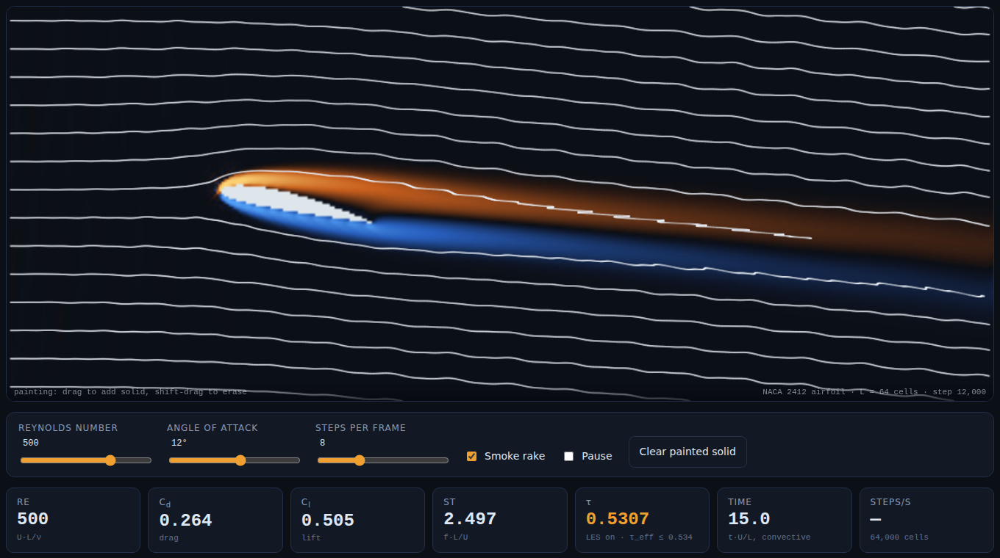
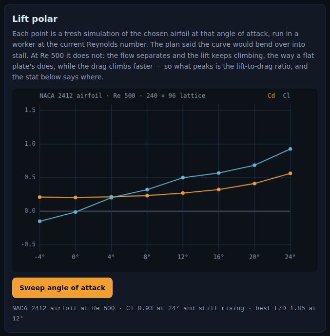
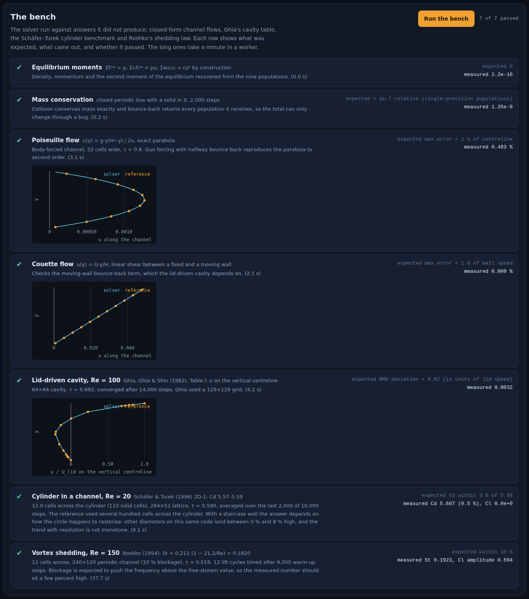

# Wake

A wind tunnel in a browser tab. A lattice-Boltzmann fluid solver written from
scratch in plain JavaScript, an obstacle you can pitch or paint with the mouse,
smoke to see the flow with, and gauges that read drag, lift and the shedding
frequency off the fluid itself — plus a bench of textbook benchmarks the solver
has to pass in front of you.

| Kármán vortex street, cylinder at Re 150 | NACA 2412 at 12°, Re 500 |
|:---:|:---:|
|  |  |

| Lift polar, each point a fresh simulation | The bench |
|:---:|:---:|
|  |  |

See [`PRD.md`](./PRD.md) for the spec.

## Run it

```bash
cd showcase/apps/wake
python -m http.server 8080
# open http://localhost:8080
```

No build, no dependencies, no GPU compute. The solver is typed arrays and runs
unchanged in the page, in the Web Worker that does the bench and the polar, and
under Node:

```bash
node tests.mjs            # every benchmark, about 45 s
node tests.mjs cavity     # one of: moments mass poiseuille couette cavity schafer strouhal
```

## What you can do

- **Pick an obstacle**: cylinder, NACA 2412, NACA 0012, flat plate, square,
  3:1 ellipse. The airfoils and plate take an angle of attack.
- **Paint**: drag on the tunnel to add solid, shift-drag to erase. The reference
  length becomes the painted shape's height across the flow.
- **Dial the Reynolds number** from 20 to 2,000 while it runs. The relaxation
  time retunes in place; above the point where τ gets close to ½ the gauge turns
  amber and a Smagorinsky term is switched on (see below).
- **Read the gauges**: Re, C<sub>d</sub>, C<sub>l</sub>, Strouhal number, τ,
  convective time, steps per second. The strip chart underneath is the raw
  force history.
- **Sweep the angle of attack**: eight fresh simulations in a worker, one per
  angle, each averaged over 2,500 steps after a 3,500-step settle, plotted as
  they land.
- **Run the bench**: seven benchmarks with what was expected, what came out, a
  verdict, and where there is a profile to compare, a plot of it.

## How the solver works

D2Q9 lattice-Boltzmann. Each cell holds nine populations, one per lattice
velocity. A step is a collision toward the local equilibrium at rate 1/τ (BGK),
then streaming to the neighbours. Viscosity is ν = (τ − ½)/3, so a target Reynolds
number fixes τ once the inlet speed (0.08 lattice units per step) and the
reference length are chosen.

- **Solids** are halfway bounce-back: a population that would enter a solid cell
  turns around. That puts a no-slip wall half a cell outside the fluid.
- **Forces** are momentum exchange on every bounce-back link touching the
  obstacle, every step, so drag and lift are measured, not modelled.
- **Moving walls** (the lid in the cavity benchmark, the moving plate in the
  Couette benchmark) add the wall's momentum to the returned population.
- **Body forces** (the Poiseuille benchmark) use Guo's second-order forcing.
- **Inlet** is Guo's non-equilibrium extrapolation: velocity imposed, density
  taken from the neighbour, so the flow rate holds whatever pressure the channel
  builds up. **Outlet** is a convective (Sommerfeld) condition in the tunnel and
  a non-equilibrium-extrapolated pressure outlet in the channel benchmark.
- **Stabiliser**: below τ = 0.55 a Smagorinsky eddy viscosity with
  C<sub>s</sub> = 0.1 is added. It is disclosed on the τ gauge and not used by
  any benchmark.

The tunnel is 400 × 160 cells with periodic top and bottom, which means a
cylinder of 32 cells sits in a channel with 20 % blockage and sheds faster than
it would in free stream. That is a property of the experiment, not a bug, and
the Strouhal benchmark accounts for it.

## What it measures

All of these run live in the page and under `node tests.mjs`. None of the
numbers below is typed into the copy; they are what the code produced.

| Benchmark | Oracle | Result |
|---|---|---|
| Equilibrium moments | Σfᵢ = ρ, Σcᵢfᵢ = ρu, Σwᵢcᵢcᵢ = cs² by construction | 2.2e-16 |
| Mass conservation | sealed periodic box, 2,000 steps | 1.35e-8 relative drift (single-precision populations) |
| Poiseuille flow | u = g·y(H−y)/2ν | max error 0.483 % of centreline |
| Couette flow | u = U·y/H | max error 0.009 % of wall speed |
| Lid-driven cavity, Re 100 | Ghia, Ghia & Shin (1982), 129×129 grid | RMS deviation 0.0032 on a 64×64 grid |
| Cylinder in a channel, Re 20 | Schäfer & Turek (1996) 2D-1, Cd 5.57–5.59 | Cd 5.607, 0.5 % high, 12 cells across |
| Vortex shedding, Re 150 | Roshko (1954), St = 0.212(1 − 21.2/Re) = 0.182 | St 0.192, 5.7 % high in a 10 % blockage channel |

Four things came out of building it that the plan did not contain.

**The boundary conditions were the whole project.** The solver interior took an
hour and passed Poiseuille, Couette and Ghia's cavity first time. Everything
after that was the open boundaries. An equilibrium inlet pins density as well as
velocity, so as the channel's pressure builds the flow rate quietly decays: the
Schäfer–Turek drag came out at 2.17 against 5.58, which is the *free-stream*
value, because by the time the force had settled the cylinder was seeing a
weaker flow than the one prescribed. A Zou–He inlet holds the flow rate but goes
unstable at τ = 0.52 the moment the start-up pressure pulse reaches it. A
Zou–He pressure outlet reflects every vortex and sets up a standing wave between
the inlet and outlet that swings the drag between −1 and +3. What ships is
non-equilibrium extrapolation at the inlet and a convective outlet, and the
drag signal is flat within a cycle of shedding.

**A coarse benchmark is a lottery on grid phase.** The Schäfer–Turek cylinder
is placed 5 % of a diameter off the channel centreline. On a grid with 12 cells
across the cylinder that is 0.6 of a cell, and moving the circle by that much
changes which cells are solid: the drag jumps from 5.63 to 6.07 and a spurious
lift of 0.094 appears — nine times the reference lift of 0.0106, and pointing
the wrong way. Dead centre the lift is 0.0000 by symmetry, which is how the code
was shown to be symmetric. Refining does not fix it either: across 8, 10, 12,
14, 16 and 20 cells the drag lands 17 %, 0.3 %, 0.5 %, 2.4 %, 7.7 % and 5.7 %
high, not monotonically, because a staircase wall's effective diameter depends on
how the circle happens to rasterise. The page runs the 12-cell case and says all
of this in the row rather than picking a resolution and staying quiet.

**Blockage is measurable.** Roshko's law is for a cylinder in free stream. In a
channel ten diameters tall the shedding runs 5.7 % fast, and in the 20 %
blockage tunnel the gauge reads 0.216, 19 % fast. The Strouhal gauge on the tunnel is the
number for the tunnel; the bench row is the number for the benchmark geometry;
neither is the textbook number, and the page says why.

**The airfoil does not stall.** The polar caption was written before the sweep
ran and promised the curve would bend over. At Re 500 it does not: from −4° to
24° the NACA 2412's lift climbs from −0.15 to 0.93 and is still rising at the
last point, the way a flat plate's does once the flow is fully separated, while
the drag climbs from 0.20 to 0.56. What peaks is the lift-to-drag ratio, at 1.85
and 12°. The caption now says that instead.

## Files

```
index.html, style.css, main.js   page, controls, gauges, painting, worker glue
js/lbm.js                        the solver: D2Q9, BGK, Guo forcing, bounce-back,
                                 momentum exchange, NEEP inlet, convective outlet,
                                 Smagorinsky, sponge
js/shapes.js                     NACA 4-digit generator, polygon rasteriser, cylinder
js/tunnel.js                     tunnel setup shared by page and worker, polar points
js/selftest.js                   the seven benchmarks
js/worker.js                     runs the bench and the sweep off the main thread
js/render.js                     colour ramps, field painter, smoke rake
js/charts.js                     strip chart, polar, profile plots
tests.mjs                        runs the benchmarks under Node
```

## References

- Krüger, Kusumaatmaja, Kuzmin, Shardt, Silva, Viggen, *The Lattice Boltzmann
  Method: Principles and Practice* (2017).
- Guo, Zheng & Shi, "Discrete lattice effects on the forcing term in the lattice
  Boltzmann method", *Phys. Rev. E* 65 (2002).
- Guo, Zheng & Shi, "Non-equilibrium extrapolation method for velocity and
  pressure boundary conditions in the lattice Boltzmann method", *Chinese
  Physics* 11 (2002).
- Ghia, Ghia & Shin, "High-Re solutions for incompressible flow using the
  Navier–Stokes equations and a multigrid method", *J. Comput. Phys.* 48 (1982).
- Schäfer & Turek, "Benchmark computations of laminar flow around a cylinder",
  *Flow Simulation with High-Performance Computers II* (1996).
- Roshko, "On the development of turbulent wakes from vortex streets", NACA
  Report 1191 (1954).
