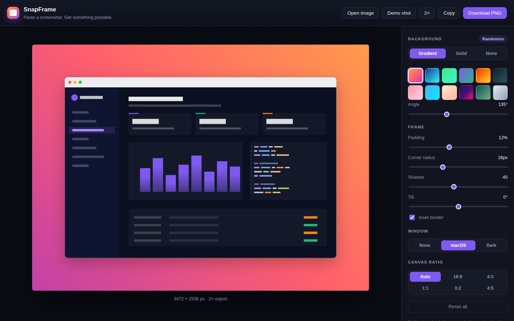
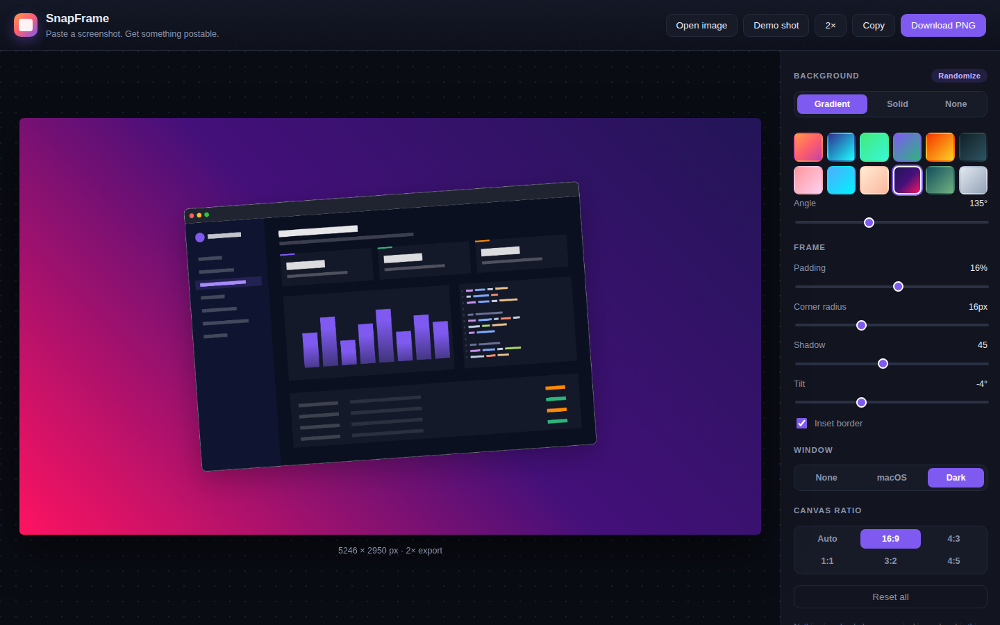

# SnapFrame

Paste a screenshot, get something worth posting. SnapFrame wraps a raw image in
a gradient background with padding, rounded corners, a soft shadow, an optional
macOS/dark window bar and a slight tilt — then exports a PNG at 1× or 2×, or
copies it straight to the clipboard. Everything is rendered on a canvas in your
own tab; the image is never uploaded anywhere.

| Framed shot | Tilted, dark chrome, 16:9 |
|:---:|:---:|
|  |  |

## Run it

```bash
cd snapframe
python -m http.server 8080
# open http://localhost:8080
```

ES modules need an HTTP server — opening `index.html` over `file://` will not work.

## Using it

1. **Load an image** — press <kbd>⌘/Ctrl</kbd>+<kbd>V</kbd> to paste a screenshot,
   drag a file onto the canvas, click **Open image**, or hit **Demo shot** to
   load a procedurally drawn sample UI.
2. **Style it** — pick a gradient (or a solid colour, or no background at all),
   then adjust padding, corner radius, shadow and tilt. **Randomize** rolls a new
   gradient and angle.
3. **Export** — **Download PNG** saves at the selected scale; **Copy** puts the
   PNG on the clipboard for pasting into Slack, a PR, or a slide.

The label under the canvas always shows the exact pixel size you will get.

### Keyboard

| Key | Action |
|-----|--------|
| <kbd>⌘/Ctrl</kbd>+<kbd>V</kbd> | Paste an image from the clipboard |
| <kbd>⌘/Ctrl</kbd>+<kbd>S</kbd> | Download PNG |
| <kbd>⌘/Ctrl</kbd>+<kbd>C</kbd> | Copy PNG to clipboard |
| <kbd>R</kbd> | Randomize the background |

## Controls

| Control | Range | Notes |
|---------|-------|-------|
| Background | Gradient / Solid / None | 12 gradient presets; "None" exports real transparency |
| Angle | 0–360° | Gradient direction |
| Padding | 0–30% | Percentage of the image's long edge, so it scales with the shot |
| Corner radius | 0–48 px | Applied to the image and to the window bar's top corners |
| Shadow | 0–100 | One slider drives blur, offset and opacity together |
| Tilt | −12° … +12° | The canvas grows so no corner gets clipped |
| Inset border | on/off | 1 px translucent white stroke on the image edge |
| Window | None / macOS / Dark | Title bar with traffic lights, drawn above the image |
| Canvas ratio | Auto, 16:9, 4:3, 1:1, 3:2, 4:5 | Non-auto ratios grow the short side and centre the frame |
| Export scale | 1× / 2× | 2× keeps text crisp on retina displays and in slides |

## How it works

`render.js` holds one drawing function used for **both** the preview and the
export:

```
layout(image, settings)   → canvas size at 1×, accounting for padding,
                            the window bar, tilt sweep and the ratio lock
render(ctx, image, s, k)  → background → tilt → shadow → rounded clip →
                            image → window chrome → inset border, all at scale k
```

The preview renders at a fit-to-screen scale, the export renders the same
function at 1× or 2× into an offscreen canvas — so the preview cannot drift from
the file you download.

Clipboard images arrive as blobs and go through `createImageBitmap()` (falling
back to an `` + canvas path on browsers that reject the blob), which
guarantees the renderer always sees correct intrinsic dimensions.

## Files

| File | Role |
|------|------|
| `index.html` | Editor layout — canvas stage plus the control panel |
| `style.css` | Dark editor chrome, checkerboard preview backing, controls |
| `main.js` | UI wiring, image input (paste/drop/file), export and clipboard |
| `render.js` | Layout maths and all canvas drawing |
| `presets.js` | Gradients, ratios, window frames, default settings |
| `demo.js` | Procedurally drawn sample screenshot for the demo button |
| `PRD.md` | Product requirements document |

## Dependencies

None. No build step, no framework, no network calls.

## Notes

- **Copy** needs `ClipboardItem`, supported in Chrome, Edge and Safari. Where it
  is unavailable or blocked, SnapFrame falls back to downloading the PNG.
- Transparent backgrounds show a checkerboard in the preview; the exported PNG
  contains real alpha, not the checkerboard.
