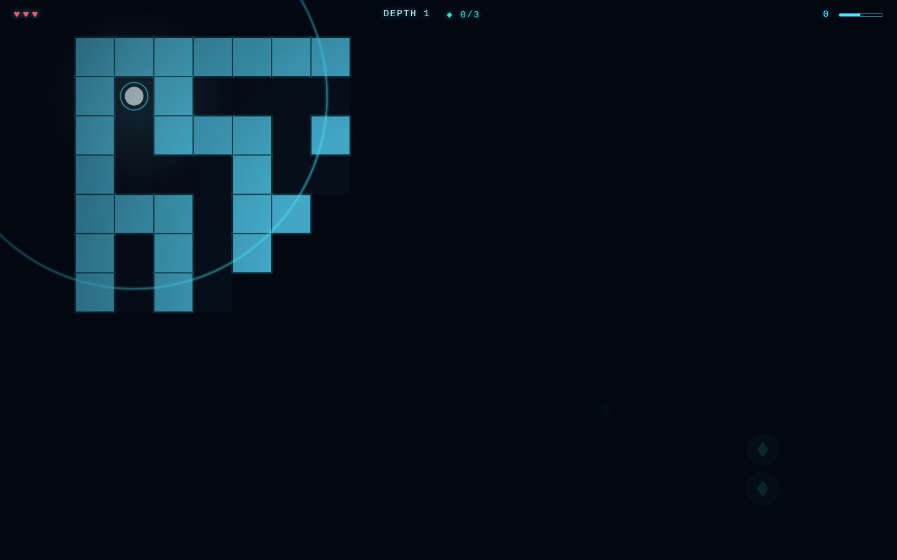
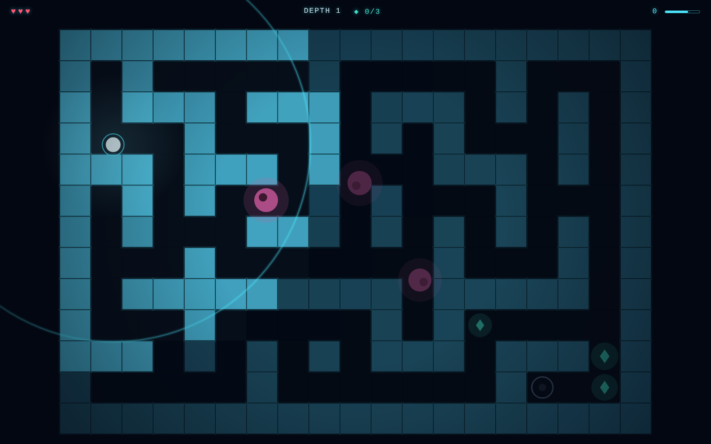

# SONAR — Echoes in the Dark

A stealth-maze arcade game played almost entirely in darkness. You navigate a
pitch-black labyrinth where the only way to *see* is to emit echolocation pings that
briefly paint the walls in light — but every ping is also a dinner bell for the blind
lurkers that hunt sound. Collect every echo shard, unlock the exit gate, and descend
as deep as you can on three hearts.

| First ping | Deep in a run |
|:---:|:---:|
|  |  |

## How to run

```bash
cd sonar
python3 -m http.server 8080
# open http://localhost:8080
```

ES modules require an HTTP server — opening `index.html` via `file://` will not work.

## How to play

| Input | Action |
|---|---|
| `WASD` / arrow keys | Move (smooth, slides along walls) |
| `Space` / click | Ping — reveals the world as the wavefront passes; ~0.9 s cooldown |

- **Shards (teal ◆)** — collect all of them to unlock the exit. They twinkle faintly
  on their own.
- **Exit gate** — dim ring while locked; glows gold and pulses once every shard is
  collected.
- **Lurkers (magenta blobs)** — blind, but they rush toward the *origin* of any ping
  they hear, and they sense you if you move within arm's reach. Touching one costs a
  heart. A rising heartbeat (sound + red screen throb) warns you one is close.
- **Hearts** — three per run. Lose them all and the run ends; score and best score
  (localStorage) are kept.
- Each cleared depth generates a bigger maze with more, faster, sharper-eared lurkers.

The core tension: pinging is the only way to see where you're going, and the fastest
way to die. Ping-and-move — lurkers converge on where you *were*.

## Key parameters (`src/game.js`)

| Constant | Default | Meaning |
|---|---|---|
| `PING_SPEED` | 9.5 tiles/s | How fast the wavefront expands |
| `PING_COOLDOWN` | 0.9 s | Delay between pings |
| `LIGHT_DECAY` | 1/3.5 | Afterimage fade rate (full fade ≈ 3.5 s) |
| `AMBIENT_RADIUS` | 2.3 tiles | Always-on glow around the player |
| `PLAYER_SPEED` | 4.4 tiles/s | Movement speed |
| `levelConfig()` | — | Per-level maze size, shard/lurker counts, lurker speeds, hearing radius |

## Architecture

- `src/maze.js` — recursive-backtracker maze generation, loop punching, BFS distance
  field (used to place the exit at the farthest cell and spread shards by depth)
- `src/game.js` — simulation: movement with circle-vs-grid collision, ping wavefront
  + light field, lurker AI (wander / aggro-to-ping / proximity sense), pickups, damage
- `src/renderer.js` — Canvas 2D: light-field tile rendering with glow, ping rings,
  entities, vignette, danger throb, title-screen idle rings
- `src/audio.js` — Web Audio synthesis (no assets): ping sweep with delay-line echo,
  chimes, heartbeat, drone
- `src/input.js`, `src/main.js` — input state and the title/play/clear/over state machine

## Dependencies

None. Vanilla JS, ES modules, Canvas 2D, Web Audio API.

See [PRD.md](PRD.md) for the full product spec.
