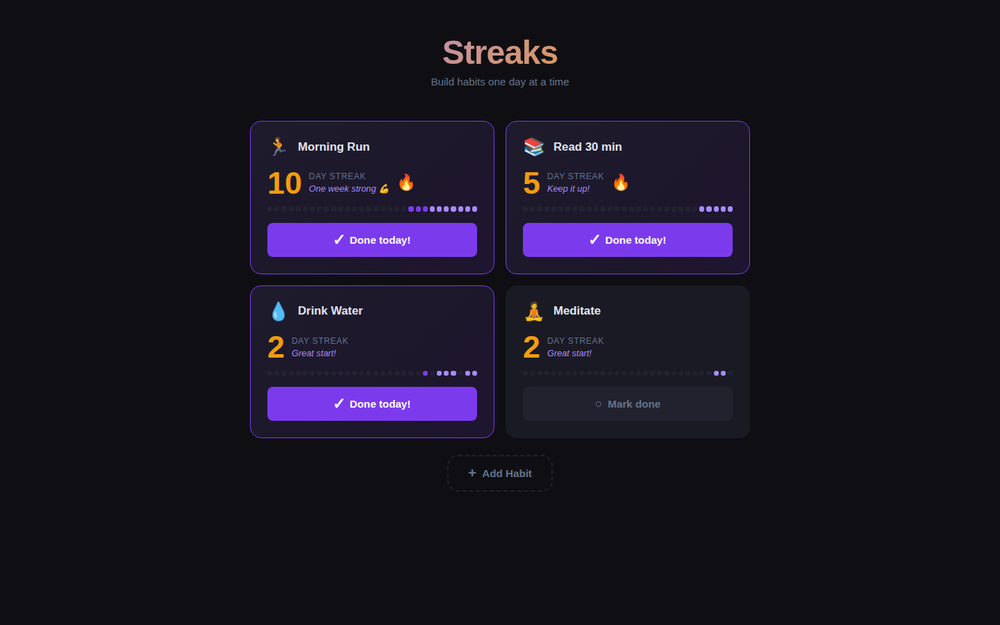
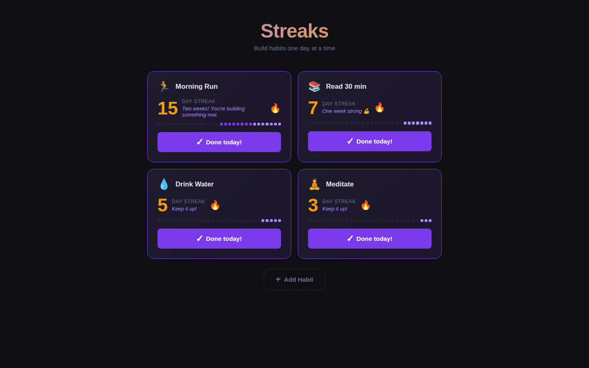

# Streaks — Habit Tracker

A minimal, beautiful habit streak tracker. Add up to 6 daily habits, check them off, and watch your streaks grow. All data lives in your browser's `localStorage` — no sign-up required.

| With active streaks | All habits done today |
|:---:|:---:|
|  |  |

## Features

- **Add up to 6 habits** — pick an emoji icon and name your habit
- **Daily check-off** — tap to mark done; confetti burst on completion
- **Streak counter** — 🔥 at 3+ days, 🏆 at 30+ days
- **30-day heatmap** — visual calendar of the last 30 days per habit
- **Motivational messages** — dynamic encouragement based on streak length
- **Persistent** — all data saved in `localStorage`, survives page refresh

## Stack

- Vanilla JS (ES Modules)
- CSS3 animations
- `localStorage` for persistence
- No dependencies, no build step

## How to run

```bash
cd streaks
python3 -m http.server 8080
# open http://localhost:8080
```

## Key parameters

| Setting | Value |
|---------|-------|
| Max habits | 6 |
| Heatmap window | 30 days |
| History retained | 90 days |
| Fire icon threshold | 3-day streak |
| Trophy icon threshold | 30-day streak |
