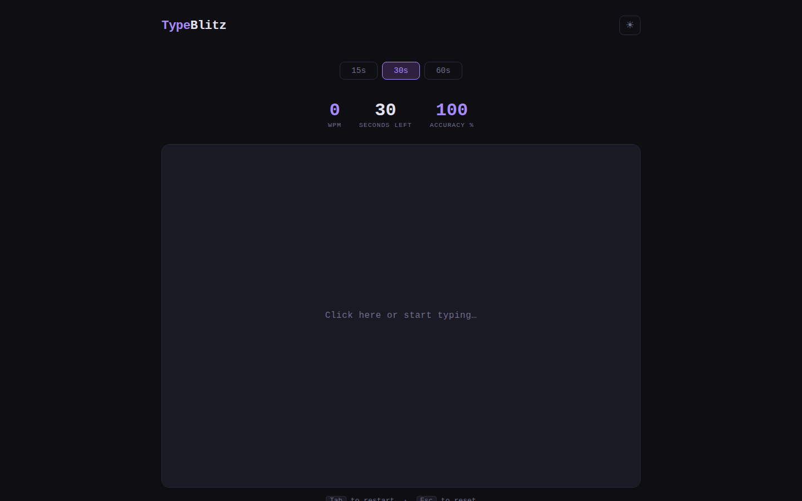
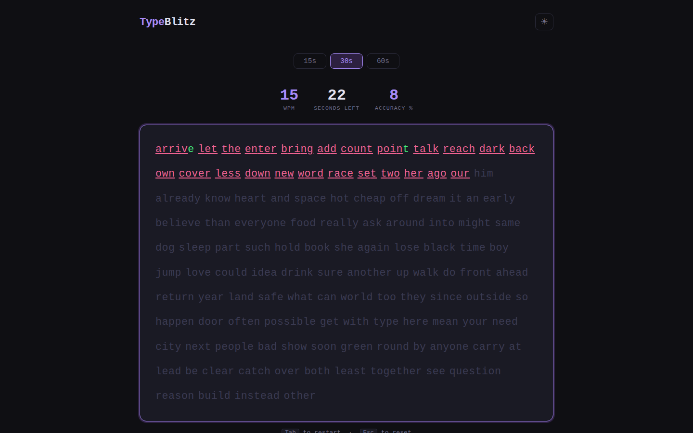

# TypeBlitz — Typing Speed Test

A minimal, beautiful browser-based typing speed test. Track your WPM and accuracy, save personal bests, and improve your typing speed with 15 / 30 / 60 second modes.

| Early state | Settled state |
|:---:|:---:|
|  |  |

## Features

- **Three modes:** 15 s, 30 s, 60 s
- **Live feedback:** correct chars in green, errors in red with underline
- **Real-time WPM + accuracy** counter while you type
- **Personal best** stored in localStorage per mode
- **Dark / Light theme** toggle
- **Keyboard shortcuts:** `Tab` to restart, `Esc` to reset, `Backspace` to correct

## How to run

```bash
cd typeblitz
python3 -m http.server 8080
# open http://localhost:8080
```

No build step, no dependencies.

## Stack

Vanilla HTML / CSS / JS (single file, ES modules)
