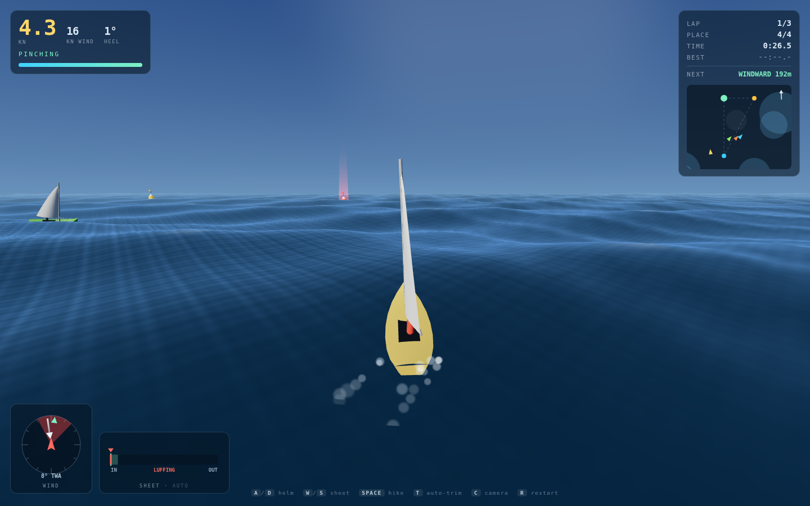
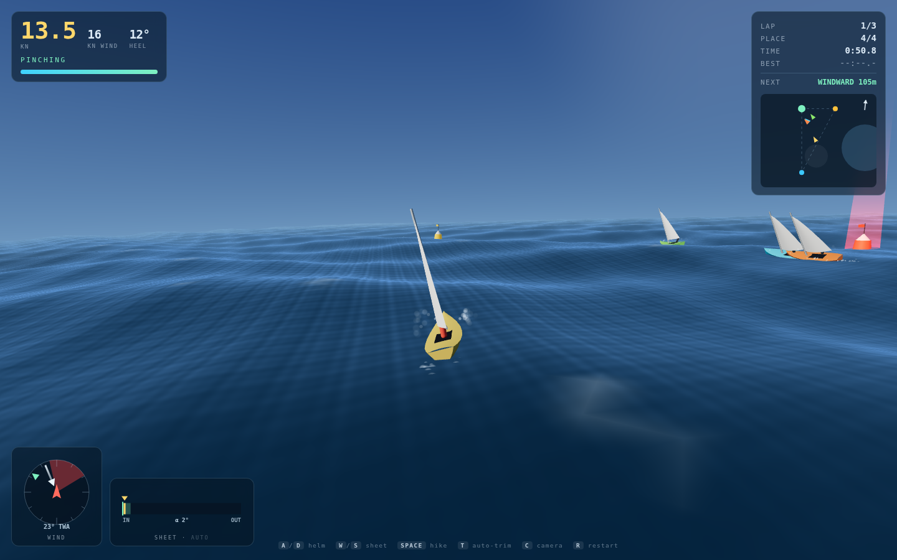
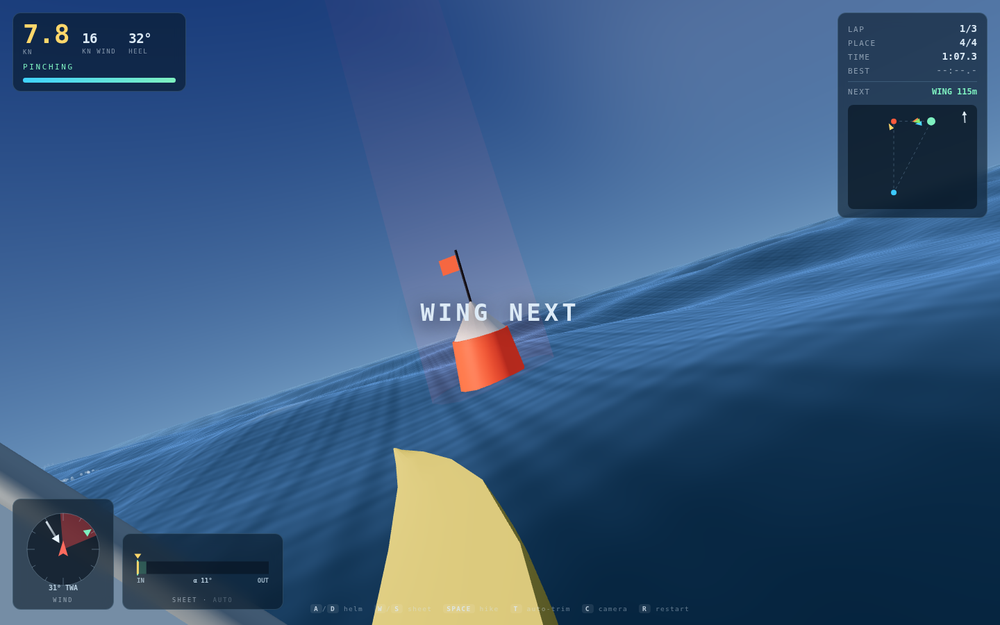
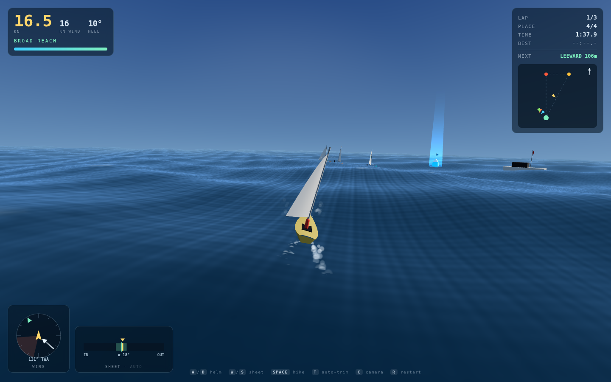

# WINDWARD

A 3D sailing regatta with **no throttle**. You get a rudder and a sheet — the
wind decides how fast you go, and it flatly refuses to let you sail straight at
the mark you are trying to reach.

| Beating upwind | The windward mark |
|:---:|:---:|
|  |  |

| From the helm | Running downwind |
|:---:|:---:|
|  |  |

## Run it

```bash
cd windward
python3 -m http.server 8080
# open http://localhost:8080
```

No build step, no install, no network at runtime — Three.js is vendored in
`vendor/`. ES modules need a real HTTP server, so `file://` will not work.

## Controls

| Key | Action |
|---|---|
| `A` `D` / `←` `→` | Rudder |
| `W` `S` / `↑` `↓` | Sheet in / ease out |
| `Space` (hold) | Hike out — cancels heel, drains stamina |
| `T` | Auto-trim assist |
| `C` | Camera: chase → helm → orbit |
| `M` | Sound |
| `R` | Restart · `Esc` pause |

**New here?** Press `T` for auto-trim, sail with `A`/`D` only, and watch the
wind dial. Turn auto-trim off once the no-go zone makes sense — trimming
by hand is worth about 25% more speed.

## The three things that make it a game

**1. You cannot sail at the mark.** Inside a 36° cone dead upwind the sail
cannot be sheeted flat enough to bite. It flogs, and a flogging sail is a
parachute — you stop, then go backwards. The windward mark is *inside* that
cone, so the only way there is a zig-zag, and choosing when to flip tacks is
the whole tactical layer. The same is true downwind for a different reason: a
dead run is 40% slower than a broad reach, so you gybe down the run too.

**2. Trim is a live input.** Drive peaks when the sail sits 20° off the
apparent wind. Every course change moves the apparent wind, so every course
change demands a re-trim. The sheet gauge shows a green band; live in it.

**3. The wind is not uniform.** Gusts drift across the course as dark ruffled
patches on the water, worth up to 60% more pressure; glassy patches are holes.
The cells you can see are literally the cells the physics samples — sailing to
a gust instead of straight at the mark is measurably faster.

## The polar

Measured from the shipped model in 8.2 m/s of true wind at optimal trim. This
table is the game:

| True wind angle | Speed | VMG | |
|---|---|---|---|
| 0° | −3.7 m/s | — | blown astern, sail flogging |
| 20° | 2.3 | 2.0 | pinching, badly stalled |
| **44°** | **6.9** | **4.6** | best upwind VMG — the beating angle |
| 90° | 9.4 | — | beam reach |
| **110°** | **9.5** | — | fastest point of sail, *above wind speed* |
| **132°** | **8.5** | **5.7** | best downwind VMG — the gybing angle |
| 180° | 5.0 | 5.0 | dead run, drag only |

## How it works

Every boat — yours and all three rivals — runs the identical physics function
in `js/sailing.js`. No cheating, no rubber-banding.

- **Apparent wind** `AW = TW − V`. Accelerating changes the wind you feel,
  which changes your drive. That feedback loop is why a boat can outrun the
  wind on a reach.
- **Lift and drag** on the sail from an angle-of-attack curve peaking at 20°
  and decaying to pure drag by 90°, resolved into forward drive and side force.
- **Side force** produces heel (30–38° upwind when overpowered, spilling drive
  past 20°) and a few degrees of **leeway**, so your track is never quite your
  heading.
- **Hull drag** is quadratic with a steep wave-making penalty near hull speed.
- **Waves** are a 4-component Gerstner sum evaluated identically on the GPU
  (vertex shader) and the CPU (buoyancy and slope), so the hull sits on the
  water it is drawn on — and the downslope component of gravity feeds back into
  drive, which is what surfing a wave face feels like.

Every piece of geometry is procedural: the hull is lofted from a table of
stations, and the mainsail is rebuilt each frame with camber that flips with
the tack and collapses into a flogging ripple when the angle of attack goes
negative. All audio is Web Audio synthesis — no files.

## Layout

```
windward/
├── PRD.md            ← product requirements
├── index.html
├── style.css
├── vendor/three.module.js
└── js/
    ├── config.js     ← every tunable constant
    ├── sailing.js    ← the physics model (no dependencies, unit-testable)
    ├── wind.js       ← wind field: shifts, gusts, lulls
    ├── ocean.js      ← Gerstner waves, GPU + matching CPU sampler
    ├── boat.js       ← lofted hull, animated rig and sail
    ├── wake.js       ← foam and spray particles
    ├── course.js     ← marks, rounding, laps, standings
    ├── ai.js         ← rival layline helm
    ├── camera.js     ├── hud.js  ├── sky.js
    ├── input.js      ├── audio.js
    ├── game.js       ← state machine and fixed-step loop
    └── main.js
```

## Key parameters

All in `js/config.js`. The ones worth touching:

| Constant | Default | Effect |
|---|---|---|
| `BOAT.alphaOpt` | 20° | Where lift peaks — moves the whole optimal-trim band |
| `BOAT.trimMin` | 9° | Sail angle with the boom hard in — **this creates the no-go zone** |
| `BOAT.dragFwd` | 10.2 | Top speed |
| `BOAT.heelStiffness` | 3100 | Newtons of side force per radian of heel |
| `WIND.baseSpeed` | 8.2 m/s | Breeze for the race |
| `WIND.gustCount` | 8 | Cells drifting across the course |
| `RACE.laps` | 3 | About 4½–5 minutes |

## Requirements

A WebGL2 browser and a keyboard. Desktop — the HUD assumes a wide viewport and
there are no touch controls.
